# ELEC5620 Project Stage 1 Report
## HomeMatch AI - Smart Rental Assistant

| Field | Value |
|-------|-------|
| **Group Name** | HomeMatch AI Team |
| **Project Title** | HomeMatch AI - Smart Rental Assistant |
| **Course** | ELEC5620 Software Engineering |
| **Date** | Wednesday, Sep 30, 2026 |
| **Tutor** | _________________ |

### Group Members

| Member | Student ID | Name | Email | Agent |
|--------|-----------|------|-------|-------|
| Member A | _________ | _________________ | _________________ | 🤖 Conversation Agent |
| Member B | _________ | _________________ | _________________ | 🎯 Matching Agent |
| Member C | _________ | _________________ | _________________ | 📄 Document Agent |
| Member D | _________ | _________________ | _________________ | 🗺️ Map Agent |
| Member E | _________ | _________________ | _________________ | 📬 Communication Agent |

---

## Group Members & Agent Responsibility Allocation

> 📌 **Note**: This project is implemented as a **Multi-Agent System** with 5 distinct agents. Each group member takes full responsibility (including code, use cases, activity diagrams, state machines, and interaction diagrams) for one agent. This allocation ensures every group member contributes equally to both individual and group tasks.

| Member | Student ID | Responsible Agent | Code Files | Document Sections |
|--------|------------|-------------------|------------|-------------------|
| **Member A** | __wending__ | 🤖 **Conversation Agent** (信息采集Agent) | `lib/conversation-agent.ts`, `lib/types.ts`, `components/ChatBubble.tsx`, `components/ChatInput.tsx` | §2 AHR-01, §5 UC-01/UC-02, §9 AD-01/AD-02, §10 ID-05, §11 STM-01 |
| **Member B** | _________ | 🎯 **Matching Agent** (房源匹配Agent) | `lib/matching-agent.ts`, `lib/properties.ts`, `components/PropertyCard.tsx`, `app/page.tsx`, `app/layout.tsx` | §2 AHR-02, §5 UC-03/UC-04, §9 AD-03, §10 ID-03, §11 STM-04 |
| **Member C** | _________ | 📄 **Document Agent** (文档识别Agent) | `lib/document-agent.ts`, `components/PassportUpload.tsx` | §2 AHR-03, §5 UC-05, §9 AD-04, §10 ID-01, §11 STM-02 |
| **Member D** | _________ | 🗺️ **Map Agent** (地图评分Agent) | `lib/map-agent.ts`, `components/MapView.tsx` | §2 AHR-04, §5 UC-04, §9 AD-05, §10 ID-02, §11 STM-05, §8 OD-01/CD-01, §13 Deployment |
| **Member E** | _________ | 📬 **Communication Agent + Integration** (通讯Agent+集成) | `lib/communication-agent.ts`, `components/ChatInterface.tsx`, `components/ApplicationForm.tsx` | §2 AHR-05, §5 UC-06, §9 AD-06, §10 ID-04, §11 STM-03, §12 Package |

### Joint Group Tasks (Shared Responsibility)
- **Member A leads, all review**: §1 Ad Hoc Diagram, §3 Feature Diagram
- **Member B leads, all review**: §4 Use Case Overall Diagram, §7 Class Diagram
- **Member E leads, all review**: §6 Architecture Analysis (4+1 View)
- **Member D leads, all review**: §13 Deployment Diagram

---

## Table of Contents
1. [Ad Hoc Diagram](#1-ad-hoc-diagram)
2. [Ad Hoc Requirements (Individual Task)](#2-ad-hoc-requirements-individual-task)
3. [Feature Diagram](#3-feature-diagram)
4. [Use Case Overall Diagram](#4-use-case-overall-diagram)
5. [Use Case Specifications (Individual Task)](#5-use-case-specifications-individual-task)
6. [Architecture Analysis and Design (Optional)](#6-architecture-analysis-and-design-optional)
7. [Elementary Structure Modelling (Class Diagram)](#7-elementary-structure-modelling-class-diagram)
8. [Complex Structure Modelling (Object/Collaboration Diagrams)](#8-complex-structure-modelling-object-and-collaboration-diagrams)
9. [Activity Diagrams (Individual Task)](#9-activity-diagrams-individual-task)
10. [Interaction Diagrams (Individual Task)](#10-interaction-diagrams-individual-task)
11. [State Machine Diagrams (Individual Task)](#11-state-machine-diagrams-individual-task)
12. [Package Diagram (Optional)](#12-package-diagram-optional)
13. [Deployment Diagram (Optional)](#13-deployment-diagram-optional)

---

## 1. Ad Hoc Diagram

> **Lead Member**: Member A (Conversation Agent) | **Reviewers**: All members

An ad hoc diagram provides a high-level overview of the software design, capturing the essence of the system without strict adherence to formal modeling conventions.

### 1.1 Overall System Overview (Ad Hoc Diagram)

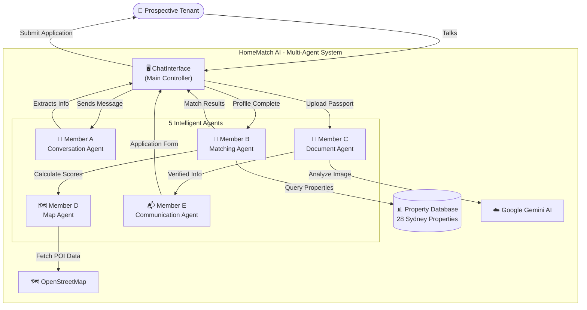
```mermaid
graph TB
    User([👤 Prospective Tenant])
    
    subgraph "HomeMatch AI - Multi-Agent System"
        UI["🖥️ ChatInterface<br/>(Main Controller)"]
        subgraph "5 Intelligent Agents"
            CA["🤖 Member A<br/>Conversation Agent"]
            MA["🎯 Member B<br/>Matching Agent"]
            DA["📄 Member C<br/>Document Agent"]
            MpA["🗺️ Member D<br/>Map Agent"]
            CoA["📬 Member E<br/>Communication Agent"]
        end
        DB[("📊 Property Database<br/>28 Sydney Properties")]
        EXT1["☁️ Google Gemini AI"]
        EXT2["🗺️ OpenStreetMap"]
    end
    
    User -->|Talks| UI
    UI -->|Sends Message| CA
    CA -->|Extracts Info| UI
    UI -->|Profile Complete| MA
    MA -->|Query Properties| DB
    MA -->|Calculate Scores| MpA
    MpA -->|Fetch POI Data| EXT2
    MA -->|Match Results| UI
    UI -->|Upload Passport| DA
    DA -->|Analyze Image| EXT1
    DA -->|Verified Info| CoA
    CoA -->|Application Form| UI
    UI -->|Submit Application| User
```

**Figure 1**: Ad hoc overview diagram showing the 5-agent architecture of HomeMatch AI.

---

## 2. Ad Hoc Requirements (Individual Task)

> ⚠️ **Individual Task**: Each student must individually contribute at least one ad hoc requirement with an informal description. Below are 5 ad hoc requirements, each owned by one group member corresponding to their agent.

---

### 2.1 AHR-01: Typo-Tolerant Suburb Recognition (Member A)

**Author**: Member A  
**Related Agent**: 🤖 Conversation Agent  
**Date**: _________

**Informal Description**:
As a prospective tenant, I often type suburb names quickly or with typos (e.g., "chatwood" instead of "Chatswood", "nwetown" instead of "Newtown"). The system should be smart enough to recognize these common misspellings and abbreviations. When the system asks "Which area would you like to live in?", I should be able to type "paddo" and have the system understand I mean "Paddington". This feature is important because:
- It reduces user frustration
- It speeds up the search process  
- It makes the system more accessible to non-native English speakers
- It handles abbreviations commonly used by locals

The Conversation Agent will implement this using Levenshtein Distance algorithm combined with a comprehensive suburb alias dictionary.

---

### 2.2 AHR-02: Multi-Dimensional Property Matching Score (Member B)

**Author**: Member B  
**Related Agent**: 🎯 Matching Agent  
**Date**: _________

**Informal Description**:
As a tenant with specific requirements (budget, area, bedrooms, special needs), I want the system to not just find matching properties but to explain WHY each property is a good or bad match. I want to see a transparent breakdown of scores in 4 dimensions:
- **Area match** (30% weight): How well does the property's suburb match my preferred areas?
- **Price match** (25% weight): How close is the rent to my budget range?
- **Bedroom match** (25% weight): Does it have the right number of bedrooms?
- **Special match** (20% weight): Does it meet my special needs (pet, parking, transport)?

The Matching Agent should also support flexible matching: if a property is in a "nearby" suburb (e.g., I want Surry Hills but it's in Darlinghurst), give partial credit instead of zero.

---

### 2.3 AHR-03: Confidence-Based Passport Verification (Member C)

**Author**: Member C  
**Related Agent**: 📄 Document Agent  
**Date**: _________

**Informal Description**:
When I upload my passport photo, I want the system to verify it's a genuine passport AND show me how confident it is about the extracted information. The Document Agent should:
1. Reject obvious non-passports (e.g., driver's license, ID card)
2. Extract key fields (Name, Passport Number, Nationality, DOB, Expiry)
3. Validate that the passport is not expired
4. Return a confidence score (0-1) so I know if I need to re-upload

Why this matters: A tenant with an expired passport shouldn't be able to submit an application. And if the OCR is uncertain (e.g., blurry photo), the system should warn the user to re-upload rather than proceed with potentially wrong information.

---

### 2.4 AHR-04: Proximity-Based POI Scoring (Member D)

**Author**: Member D  
**Related Agent**: 🗺️ Map Agent  
**Date**: _________

**Informal Description**:
When I'm comparing properties, location quality matters as much as the property itself. I want the Map Agent to automatically score each property's location based on nearby Points of Interest (POIs):
- **Parks** (30% weight): Park within 500m = high score
- **Bus stops** (30% weight): Bus stop within 300m = high score
- **Train stations** (40% weight): Train station within 800m = high score

The score should use Haversine distance calculation to find the nearest POI. If the OpenStreetMap API is unavailable, the system should gracefully fall back to default scores rather than failing the entire matching process.

---

### 2.5 AHR-05: Multi-Format Application Generation (Member E)

**Author**: Member E  
**Related Agent**: 📬 Communication Agent  
**Date**: _________

**Informal Description**:
After I've found my perfect property, I want to apply quickly. The Communication Agent should generate a complete rental application in multiple formats:
- **Display format**: Form-friendly for the UI
- **Plain text format**: For easy copy-paste
- **WhatsApp/Email format**: Pre-filled message with URL encoding

The application should include my profile info, verified passport details, selected property details, and all the match scores. This way I can contact the landlord with a single click, with all my information professionally formatted and ready to go.

---

## 3. Feature Diagram

> **Lead Member**: Member A (Conversation Agent) | **Reviewers**: All members

A feature diagram models the hierarchical structure of features (functional and non-functional) of the system, organized by agent.

### 3.1 Feature Diagram


```mermaid
graph TB
    Root["🏠 HomeMatch AI<br/>Smart Rental Assistant"]
    
    Root --> F1["🤖 Conversation Agent Features<br/>(Member A)"]
    Root --> F2["🎯 Matching Agent Features<br/>(Member B)"]
    Root --> F3["📄 Document Agent Features<br/>(Member C)"]
    Root --> F4["🗺️ Map Agent Features<br/>(Member D)"]
    Root --> F5["📬 Communication Agent Features<br/>(Member E)"]
    
    F1 --> SF1["Multi-turn Conversation"]
    F1 --> SF2["Typo Recognition<br/>(Levenshtein Distance)"]
    F1 --> SF3["Budget Extraction"]
    F1 --> SF4["State Machine Logic"]
    
    F2 --> SF5["Multi-dimensional Scoring"]
    F2 --> SF6["Weighted Algorithm"]
    F2 --> SF7["Top-N Ranking"]
    
    F3 --> SF8["Passport OCR (Gemini Vision)"]
    F3 --> SF9["Document Validation"]
    F3 --> SF10["Confidence Scoring"]
    
    F4 --> SF11["POI Query (Overpass API)"]
    F4 --> SF12["Haversine Distance"]
    F4 --> SF13["Leaflet Visualization"]
    
    F5 --> SF14["Application Generation"]
    F5 --> SF15["Multi-format Export"]
    
    Root -.->|includes| NF1["⚡ Performance < 3s"]
    Root -.->|includes| NF2["🔒 Data Privacy"]
    Root -.->|includes| NF3["🌐 Usability<br/>(Typo Tolerant)"]
    Root -.->|includes| NF4["📱 Web Accessibility"]
    Root -.->|includes| NF5["🛡️ Reliability<br/>(Graceful Fallback)"]
```

**Figure 2**: Feature diagram organized by the 5-agent architecture.

### 3.2 Feature Descriptions by Agent

| Agent | Feature | Type | Description | Non-Functional |
|-------|---------|------|-------------|----------------|
| 🤖 Conversation (A) | Multi-turn Conversation | Functional | State machine-based dialogue | Usability, Performance |
| 🤖 Conversation (A) | Typo Recognition | Sub-functional | Levenshtein-based suburb matching | Accuracy > 90% |
| 🤖 Conversation (A) | Budget Extraction | Sub-functional | Parse "$400-600", "500 pw", etc. | - |
| 🤖 Conversation (A) | State Machine Logic | Sub-functional | Stage progression (GREETING→...) | - |
| 🎯 Matching (B) | Multi-dimensional Scoring | Functional | 4-dimensional evaluation | Performance < 2s |
| 🎯 Matching (B) | Weighted Algorithm | Sub-functional | Area 30% + Price 25% + Bed 25% + Spec 20% | - |
| 🎯 Matching (B) | Top-N Ranking | Sub-functional | Return top 10 matches | - |
| 📄 Document (C) | Passport OCR | Functional | Extract text from image | Accuracy > 95% |
| 📄 Document (C) | Document Validation | Sub-functional | Verify it's a passport | Security |
| 📄 Document (C) | Confidence Scoring | Sub-functional | Return OCR confidence 0-1 | Reliability |
| 🗺️ Map (D) | POI Query | Functional | Query OSM for parks/buses/trains | Performance |
| 🗺️ Map (D) | Haversine Distance | Sub-functional | Calculate proximity | - |
| 🗺️ Map (D) | Leaflet Visualization | Sub-functional | Interactive map display | Usability |
| 📬 Communication (E) | Application Generation | Functional | Create rental application | - |
| 📬 Communication (E) | Multi-format Export | Sub-functional | Display/Text/Email formats | - |

---

## 4. Use Case Overall Diagram

> **Lead Member**: Member B (Matching Agent) | **Reviewers**: All members

This diagram encompasses all 6 use cases from all 5 agents and their stakeholders.

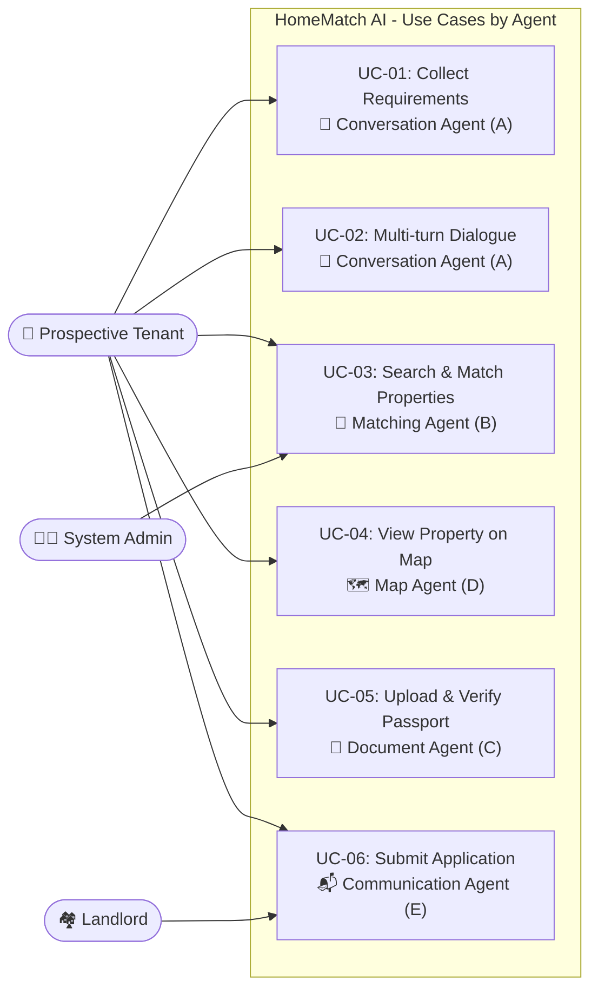
```mermaid
graph LR
    Tenant([👤 Prospective Tenant])
    Landlord([🏘️ Landlord])
    Admin([👨‍💼 System Admin])
    
    subgraph "HomeMatch AI - Use Cases by Agent"
        UC01["UC-01: Collect Requirements<br/>🤖 Conversation Agent (A)"]
        UC02["UC-02: Multi-turn Dialogue<br/>🤖 Conversation Agent (A)"]
        UC03["UC-03: Search & Match Properties<br/>🎯 Matching Agent (B)"]
        UC04["UC-04: View Property on Map<br/>🗺️ Map Agent (D)"]
        UC05["UC-05: Upload & Verify Passport<br/>📄 Document Agent (C)"]
        UC06["UC-06: Submit Application<br/>📬 Communication Agent (E)"]
    end
    
    Tenant --> UC01
    Tenant --> UC02
    Tenant --> UC03
    Tenant --> UC04
    Tenant --> UC05
    Tenant --> UC06
    Landlord --> UC06
    Admin --> UC03
```

**Figure 3**: Overall use case diagram with agent ownership clearly labeled.

---

## 5. Use Case Specifications (Individual Task)

> ⚠️ **Individual Task**: Each student contributes 1-2 use case specifications based on their agent. Total of 6 use cases for the group.

---

### UC-01: Collect User Rental Requirements (Member A)

**Author**: Member A  
**Related Agent**: 🤖 Conversation Agent

| Field | Description |
|-------|-------------|
| **ID** | UC-01 |
| **Name** | Collect User Rental Requirements |
| **Primary Actor** | Prospective Tenant |
| **Secondary Actors** | Conversation Agent |
| **Preconditions** | User has accessed the HomeMatch AI web application |
| **Postconditions** | User profile is created and stored with rental preferences |
| **Trigger** | User opens the application for the first time |

**Main Flow**:
1. System displays greeting message: "Welcome to HomeMatch AI!"
2. User provides their name (or skips)
3. System stores name and asks about budget range
4. User provides budget (e.g., "$400-600/week" or "around 500")
5. System extracts budget range and asks about preferred areas
6. User provides suburb names (supports typos like "chatwood")
7. System normalizes suburb names and asks about bedroom requirements
8. User specifies bedrooms (e.g., "2", "studio", "three bedrooms")
9. System asks about move-in date
10. User provides timeline (e.g., "ASAP", "next month")
11. System asks about special requirements
12. User specifies requirements (pet-friendly, parking, etc.)
13. System confirms collected information

**Alternative Flows**:
- **A1**: User skips any question → System uses default values
- **A2**: User provides all info at once → System extracts all and skips questions

**Non-Functional Requirements**:
- Response time < 2 seconds per query
- Typo tolerance with 90% accuracy
- Support for natural language variations

---

### UC-02: Conduct Multi-turn Dialogue (Member A)

**Author**: Member A  
**Related Agent**: 🤖 Conversation Agent

| Field | Description |
|-------|-------------|
| **ID** | UC-02 |
| **Name** | Conduct Multi-turn Dialogue |
| **Primary Actor** | Prospective Tenant |
| **Secondary Actors** | Conversation Agent (LLM-powered) |

**Main Flow**:
1. User sends a message
2. System determines current conversation stage
3. System invokes Gemini LLM with context (previous profile + current stage)
4. LLM extracts user information and generates reply
5. System parses LLM JSON response
6. System updates user profile
7. System advances conversation stage
8. System displays friendly reply to user
9. If API fails, fall back to rule-based processing

**Alternative Flows**:
- **A1**: LLM unavailable → Use simple rules-based engine
- **A2**: Invalid JSON from LLM → Retry once, then fall back

---

### UC-03: Search and Match Properties (Member B)

**Author**: Member B  
**Related Agent**: 🎯 Matching Agent

| Field | Description |
|-------|-------------|
| **ID** | UC-03 |
| **Name** | Search and Match Properties |
| **Primary Actor** | Matching Agent (System) |
| **Triggered by** | Completion of UC-01 |

**Main Flow**:
1. System retrieves user profile from Conversation Agent
2. System queries property database (28 Sydney properties)
3. For each property, calculate:
   - Area match score (30% weight)
   - Price match score (25% weight)
   - Bedroom match score (25% weight)
   - Special requirements score (20% weight)
4. System queries MapAgent for proximity scores
5. MapAgent queries OpenStreetMap for nearby POIs
6. System calculates total score (match + map scores)
7. System ranks properties by total score
8. System returns top 10 matches

**Alternative Flows**:
- **A1**: No preferred areas → Default to all suburbs with 100% area score
- **A2**: No budget → Default to 100% price score

---

### UC-04: View Property on Interactive Map (Member D)

**Author**: Member D  
**Related Agent**: 🗺️ Map Agent

| Field | Description |
|-------|-------------|
| **ID** | UC-04 |
| **Name** | View Property on Interactive Map |
| **Primary Actor** | Prospective Tenant |

**Main Flow**:
1. User views matched properties in card view
2. User sees map with property markers (Leaflet)
3. User clicks on a property card or marker
4. Map centers on selected property (zoom level 15)
5. Map shows color-coded markers (green=available, blue=selected)
6. Popup shows property details (address, price, scores)
7. Legend displays scoring categories (park/bus/train)

---

### UC-05: Upload and Verify Passport (Member C)

**Author**: Member C  
**Related Agent**: 📄 Document Agent

| Field | Description |
|-------|-------------|
| **ID** | UC-05 |
| **Name** | Upload and Verify Passport |
| **Primary Actor** | Prospective Tenant |
| **Preconditions** | User has selected a property |

**Main Flow**:
1. System displays passport upload interface
2. User drags/drops or selects passport image
3. System validates file type (image only)
4. System displays image preview
5. User clicks "Verify Passport"
6. System converts image to base64
7. System sends image to Google Gemini Vision API
8. System validates document is a passport
9. System extracts: Name, Passport Number, Nationality, DOB, Expiry
10. System checks expiry date (must not be expired)
11. System returns confidence score
12. System displays verification result
13. User confirms information

**Alternative Flows**:
- **A1**: User clicks "Skip for now" → Application proceeds with limited features
- **A2**: Image is not a passport → Error message displayed
- **A3**: Image is blurry → System requests clearer image
- **A4**: Passport expired → Error: "Cannot use expired passport"

---

### UC-06: Submit Rental Application (Member E)

**Author**: Member E  
**Related Agent**: 📬 Communication Agent

| Field | Description |
|-------|-------------|
| **ID** | UC-06 |
| **Name** | Submit Rental Application |
| **Primary Actor** | Prospective Tenant |
| **Preconditions** | Property selected + Identity verified |

**Main Flow**:
1. System generates application form with:
   - User profile (from Conversation Agent)
   - Verified passport details (from Document Agent)
   - Selected property info (from Matching Agent)
   - All match scores
2. User reviews information
3. User adds optional notes
4. User clicks "Submit Application"
5. Communication Agent packages application
6. System displays confirmation
7. Application is ready to be sent to landlord

**Alternative Flows**:
- **A1**: User wants to contact landlord directly → Generate WhatsApp/Email link
- **A2**: User wants plain text → Generate plain text version

---

## 6. Architecture Analysis and Design (Optional)

> **Lead Member**: Member E (Communication Agent + Integration) | **Reviewers**: All members

Based on the "4+1" View Model, the architecture analysis is presented from 5 different viewpoints, each corresponding to one agent's perspective.

### 6.1 Logical View - Multi-Agent Component Architecture

```
┌─────────────────────────────────────────────────────────────────────────────┐
│              LOGICAL ARCHITECTURE (5-Agent Multi-Agent System)               │
├─────────────────────────────────────────────────────────────────────────────┤
│                                                                             │
│   ┌─────────────────────────────────────────────────────────────────────┐   │
│   │                    PRESENTATION LAYER                               │   │
│   │  ┌─────────────────┐  ┌─────────────────┐  ┌─────────────────────┐ │   │
│   │  │  ChatInterface  │  │ ChatBubble/Input│  │ PropertyCard/MapView│ │   │
│   │  │   (Member E)    │  │   (Member A)    │  │  (Members B, D)     │ │   │
│   │  └─────────────────┘  └─────────────────┘  └─────────────────────┘ │   │
│   │  ┌─────────────────┐  ┌─────────────────┐                            │   │
│   │  │ PassportUpload  │  │ ApplicationForm │                            │   │
│   │  │   (Member C)    │  │   (Member E)    │                            │   │
│   │  └─────────────────┘  └─────────────────┘                            │   │
│   └─────────────────────────────────────────────────────────────────────┘   │
│                                      │                                        │
│                                      ▼                                        │
│   ┌─────────────────────────────────────────────────────────────────────┐   │
│   │                  AGENT LAYER (5 Intelligent Agents)                  │   │
│   │  ┌──────────────┐  ┌──────────────┐  ┌──────────────┐  ┌─────────┐│   │
│   │  │Conversation  │  │  Matching    │  │  Document    │  │   Map   ││   │
│   │  │   Agent      │  │   Agent      │  │   Agent      │  │  Agent  ││   │
│   │  │ (Member A)   │  │ (Member B)   │  │ (Member C)   │  │(Member D)│   │
│   │  └──────────────┘  └──────────────┘  └──────────────┘  └─────────┘│   │
│   │  ┌──────────────────────────────────────────────────────────────┐  │   │
│   │  │             Communication Agent (Member E)                    │  │   │
│   │  └──────────────────────────────────────────────────────────────┘  │   │
│   └─────────────────────────────────────────────────────────────────────┘   │
│                                      │                                        │
│                                      ▼                                        │
│   ┌─────────────────────────────────────────────────────────────────────┐   │
│   │                       DATA LAYER                                     │   │
│   │  ┌─────────────┐  ┌─────────────┐  ┌─────────────┐                │   │
│   │  │ UserProfile │  │  Property   │  │ PassportInfo│                │   │
│   │  │  (types.ts) │  │(properties) │  │  (types.ts) │                │   │
│   │  │  (Member A) │  │  (Member B) │  │  (Member C) │                │   │
│   │  └─────────────┘  └─────────────┘  └─────────────┘                │   │
│   └─────────────────────────────────────────────────────────────────────┘   │
│                                      │                                        │
│                                      ▼                                        │
│   ┌─────────────────────────────────────────────────────────────────────┐   │
│   │                    EXTERNAL SERVICES                                 │   │
│   │  ┌──────────────────────┐  ┌──────────────────────┐                 │   │
│   │  │ Google Gemini API    │  │ OpenStreetMap API    │                 │   │
│   │  │  (A, C use it)       │  │     (D uses it)      │                 │   │
│   │  └──────────────────────┘  └──────────────────────┘                 │   │
│   └─────────────────────────────────────────────────────────────────────┘   │
└─────────────────────────────────────────────────────────────────────────────┘
```

### 6.2 Process View - Concurrency

The system uses single-threaded React with async/await for I/O-bound operations:
- **Main Thread**: UI rendering, event handling (Member E's ChatInterface)
- **Async Tasks**: LLM API calls (Members A, C), Map API calls (Member D)
- **Synchronization**: Promise.all() for parallel property scoring

### 6.3 4+1 View Mapping to Members

| View | Description | Lead Member |
|------|-------------|-------------|
| Logical | Multi-agent component structure | Member E |
| Process | Runtime behavior & concurrency | Member E |
| Development | Module organization | Member E |
| Physical | Deployment architecture | Member D |
| +1 Scenarios | Use case realizations | All (each owns own UC) |

---

## 7. Elementary Structure Modelling (Class Diagram)

> **Lead Member**: Member B (Matching Agent) | **Reviewers**: All members

This class diagram captures the structure of all 5 agents and their relationships.

### 7.1 Class Diagram

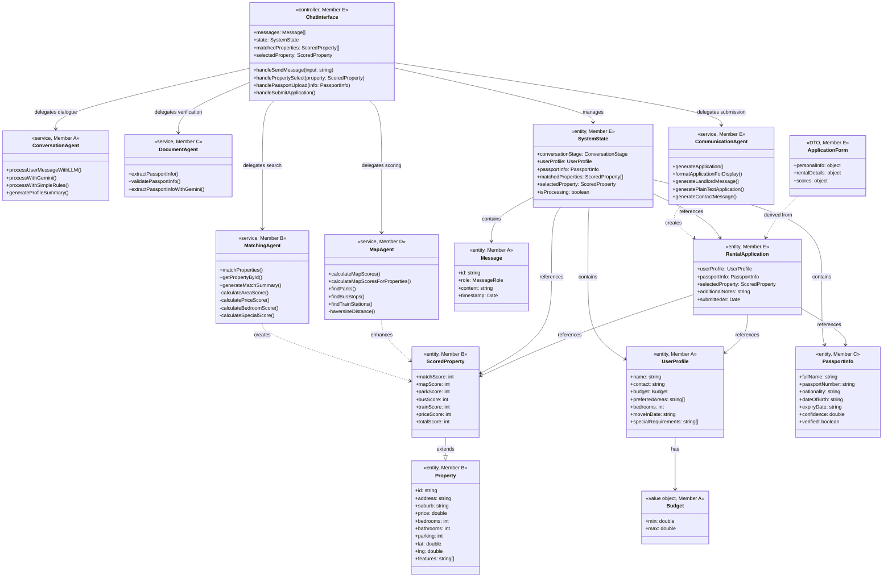
```mermaid
classDiagram
    class ChatInterface {
        <<controller, Member E>>
        +messages: Message[]
        +state: SystemState
        +matchedProperties: ScoredProperty[]
        +selectedProperty: ScoredProperty
        +handleSendMessage(input: string)
        +handlePropertySelect(property: ScoredProperty)
        +handlePassportUpload(info: PassportInfo)
        +handleSubmitApplication()
    }
    
    class ConversationAgent {
        <<service, Member A>>
        +processUserMessageWithLLM()
        +processWithGemini()
        +processWithSimpleRules()
        +generateProfileSummary()
    }
    
    class DocumentAgent {
        <<service, Member C>>
        +extractPassportInfo()
        +validatePassportInfo()
        +extractPassportInfoWithGemini()
    }
    
    class MatchingAgent {
        <<service, Member B>>
        +matchProperties()
        +getPropertyById()
        +generateMatchSummary()
        -calculateAreaScore()
        -calculatePriceScore()
        -calculateBedroomScore()
        -calculateSpecialScore()
    }
    
    class MapAgent {
        <<service, Member D>>
        +calculateMapScores()
        +calculateMapScoresForProperties()
        +findParks()
        +findBusStops()
        +findTrainStations()
        -haversineDistance()
    }
    
    class CommunicationAgent {
        <<service, Member E>>
        +generateApplication()
        +formatApplicationForDisplay()
        +generateLandlordMessage()
        +generatePlainTextApplication()
        +generateContactMessage()
    }
    
    class UserProfile {
        <<entity, Member A>>
        +name: string
        +contact: string
        +budget: Budget
        +preferredAreas: string[]
        +bedrooms: int
        +moveInDate: string
        +specialRequirements: string[]
    }
    
    class Property {
        <<entity, Member B>>
        +id: string
        +address: string
        +suburb: string
        +price: double
        +bedrooms: int
        +bathrooms: int
        +parking: int
        +lat: double
        +lng: double
        +features: string[]
    }
    
    class ScoredProperty {
        <<entity, Member B>>
        +matchScore: int
        +mapScore: int
        +parkScore: int
        +busScore: int
        +trainScore: int
        +priceScore: int
        +totalScore: int
    }
    
    class PassportInfo {
        <<entity, Member C>>
        +fullName: string
        +passportNumber: string
        +nationality: string
        +dateOfBirth: string
        +expiryDate: string
        +confidence: double
        +verified: boolean
    }
    
    class Message {
        <<entity, Member A>>
        +id: string
        +role: MessageRole
        +content: string
        +timestamp: Date
    }
    
    class SystemState {
        <<entity, Member E>>
        +conversationStage: ConversationStage
        +userProfile: UserProfile
        +passportInfo: PassportInfo
        +matchedProperties: ScoredProperty[]
        +selectedProperty: ScoredProperty
        +isProcessing: boolean
    }
    
    class Budget {
        <<value object, Member A>>
        +min: double
        +max: double
    }
    
    class RentalApplication {
        <<entity, Member E>>
        +userProfile: UserProfile
        +passportInfo: PassportInfo
        +selectedProperty: ScoredProperty
        +additionalNotes: string
        +submittedAt: Date
    }
    
    class ApplicationForm {
        <<DTO, Member E>>
        +personalInfo: object
        +rentalDetails: object
        +scores: object
    }
    
    ChatInterface --> ConversationAgent : delegates dialogue
    ChatInterface --> MatchingAgent : delegates search
    ChatInterface --> DocumentAgent : delegates verification
    ChatInterface --> MapAgent : delegates scoring
    ChatInterface --> CommunicationAgent : delegates submission
    ChatInterface --> SystemState : manages
    
    MatchingAgent ..> ScoredProperty : creates
    MapAgent ..> ScoredProperty : enhances
    CommunicationAgent ..> RentalApplication : creates
    ScoredProperty --|> Property : extends
    
    SystemState --> UserProfile : contains
    SystemState --> PassportInfo : contains
    SystemState --> ScoredProperty : references
    SystemState --> Message : contains
    SystemState --> RentalApplication : references
    
    UserProfile --> Budget : has
    RentalApplication --> UserProfile : references
    RentalApplication --> PassportInfo : references
    RentalApplication --> ScoredProperty : references
    ApplicationForm ..> RentalApplication : derived from
```

**Figure 4**: Class diagram with 5 agents (color-coded by member ownership).

### 7.2 Class-to-Agent Mapping

| Class | Owned By | Agent |
|-------|----------|-------|
| ChatInterface | Member E | Communication/Integration |
| ConversationAgent | Member A | Conversation Agent |
| MatchingAgent | Member B | Matching Agent |
| DocumentAgent | Member C | Document Agent |
| MapAgent | Member D | Map Agent |
| CommunicationAgent | Member E | Communication Agent |
| UserProfile, Budget, Message | Member A | Conversation Agent entities |
| Property, ScoredProperty | Member B | Matching Agent entities |
| PassportInfo | Member C | Document Agent entities |
| SystemState, RentalApplication, ApplicationForm | Member E | Communication Agent entities |

---

## 8. Complex Structure Modelling (Object and Collaboration Diagrams)

> **Lead Member**: Member D (Map Agent) | **Reviewers**: All members

### 8.1 Object Diagram - Map Agent Runtime Snapshot

This object diagram captures a specific moment when MapAgent is calculating scores for properties.

```mermaid
flowchart TB
    object mapAgentInstance {
        <<MapAgent, Member D>>
        status = "calculating"
        currentPropertyIndex = 3
    }
    
    object property_SydneyCBD_001 {
        id = "prop-001"
        address = "101 George Street"
        suburb = "Sydney CBD"
        lat = -33.8688
        lng = 151.2093
        price = 650
        bedrooms = 2
    }
    
    object osmResponse_parks {
        <<external, Member D>>
        query = "leisure=park"
        count = 5
        nearestDistance = 250
        responseTime = 320ms
    }
    
    object osmResponse_buses {
        <<external, Member D>>
        query = "highway=bus_stop"
        count = 12
        nearestDistance = 150
        responseTime = 280ms
    }
    
    object osmResponse_trains {
        <<external, Member D>>
        query = "railway=station"
        count = 1
        nearestDistance = 100
        responseTime = 290ms
    }
    
    object scoredProperty_001 {
        <<ScoredProperty, Member B>>
        id = "prop-001"
        matchScore = 92
        parkScore = 90
        busScore = 95
        trainScore = 100
        mapScore = 95
        totalScore = 93
    }
    
    object userProfile {
        <<UserProfile, Member A>>
        name = "John Smith"
        budget_max = 600
        preferredAreas = ["Sydney CBD"]
    }
    
    mapAgentInstance --> property_SydneyCBD_001 : processing
    mapAgentInstance --> osmResponse_parks : queried
    mapAgentInstance --> osmResponse_buses : queried
    mapAgentInstance --> osmResponse_trains : queried
    mapAgentInstance --> scoredProperty_001 : produces
    scoredProperty_001 --> userProfile : scored against
```

**Figure 5**: Object diagram showing Map Agent runtime interactions.

### 8.2 Collaboration Diagram - Multi-Agent Collaboration During Property Matching

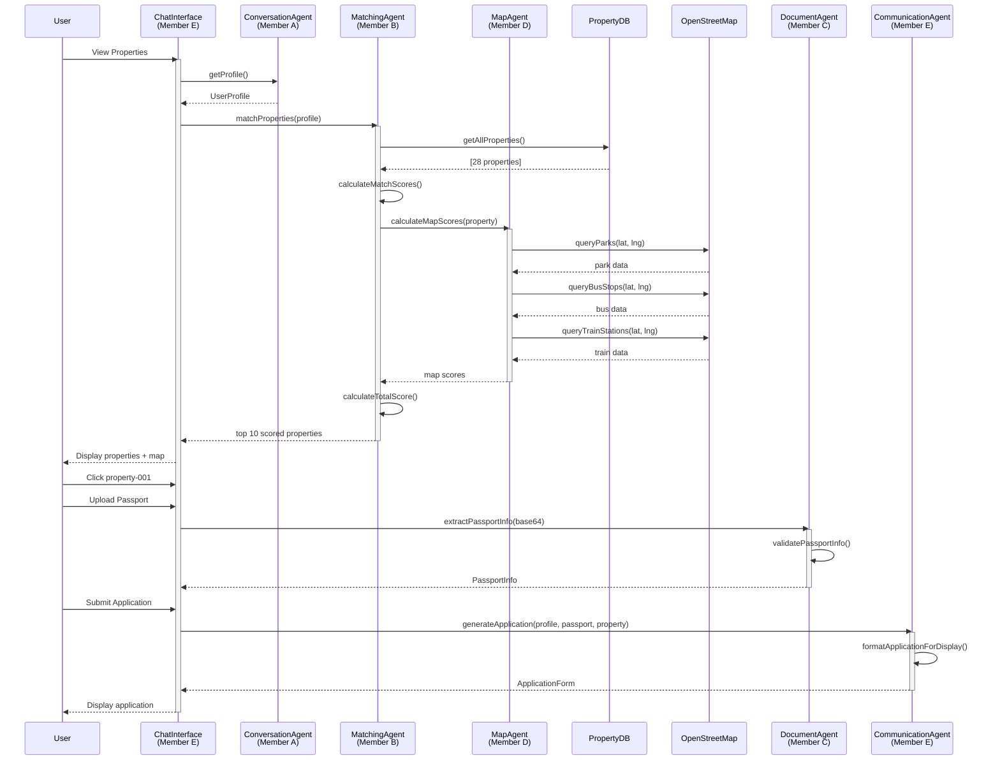
```mermaid
sequenceDiagram
    participant U as User
    participant CI as ChatInterface<br/>(Member E)
    participant CA as ConversationAgent<br/>(Member A)
    participant MA as MatchingAgent<br/>(Member B)
    participant MpA as MapAgent<br/>(Member D)
    participant DB as PropertyDB
    participant OSM as OpenStreetMap
    participant DA as DocumentAgent<br/>(Member C)
    participant CoA as CommunicationAgent<br/>(Member E)
    
    U->>CI: View Properties
    activate CI
    CI->>CA: getProfile()
    CA-->>CI: UserProfile
    CI->>MA: matchProperties(profile)
    activate MA
    MA->>DB: getAllProperties()
    DB-->>MA: [28 properties]
    MA->>MA: calculateMatchScores()
    MA->>MpA: calculateMapScores(property)
    activate MpA
    MpA->>OSM: queryParks(lat, lng)
    OSM-->>MpA: park data
    MpA->>OSM: queryBusStops(lat, lng)
    OSM-->>MpA: bus data
    MpA->>OSM: queryTrainStations(lat, lng)
    OSM-->>MpA: train data
    MpA-->>MA: map scores
    deactivate MpA
    MA->>MA: calculateTotalScore()
    MA-->>CI: top 10 scored properties
    deactivate MA
    CI-->>U: Display properties + map
    
    U->>CI: Click property-001
    U->>CI: Upload Passport
    CI->>DA: extractPassportInfo(base64)
    activate DA
    DA->>DA: validatePassportInfo()
    DA-->>CI: PassportInfo
    deactivate DA
    
    U->>CI: Submit Application
    CI->>CoA: generateApplication(profile, passport, property)
    activate CoA
    CoA->>CoA: formatApplicationForDisplay()
    CoA-->>CI: ApplicationForm
    deactivate CoA
    CI-->>U: Display application
    deactivate CI
```

**Figure 6**: Collaboration diagram showing all 5 agents working together.

---

## 9. Activity Diagrams (Individual Task)

> ⚠️ **Individual Task**: Each student must individually contribute at least one activity diagram modeling specific behaviors of their agent.

### 9.1 AD-01: Conversation Agent Multi-turn Dialogue (Member A)

**Author**: Member A  
**Related Agent**: 🤖 Conversation Agent

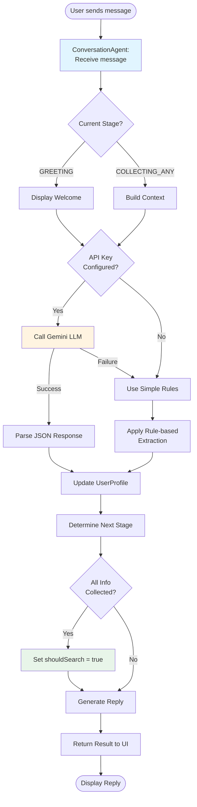
```mermaid
flowchart TD
    Start([User sends message]) --> A[ConversationAgent:<br/>Receive message]
    A --> B{Current Stage?}
    B -->|GREETING| C[Display Welcome]
    B -->|COLLECTING_ANY| D[Build Context]
    C --> E
    D --> E{API Key<br/>Configured?}
    E -->|Yes| F[Call Gemini LLM]
    E -->|No| G[Use Simple Rules]
    F -->|Success| H[Parse JSON Response]
    F -->|Failure| G
    H --> I[Update UserProfile]
    G --> J[Apply Rule-based<br/>Extraction]
    J --> I
    I --> K[Determine Next Stage]
    K --> L{All Info<br/>Collected?}
    L -->|Yes| M[Set shouldSearch = true]
    L -->|No| N[Generate Reply]
    M --> N
    N --> O[Return Result to UI]
    O --> End([Display Reply])
    
    style A fill:#e1f5ff
    style F fill:#fff4e1
    style M fill:#e8f5e9
```

**Figure 7**: Activity diagram of Conversation Agent dialogue processing.

---

### 9.2 AD-02: Conversation Agent Typo Recognition Process (Member A)

**Author**: Member A  
**Related Agent**: 🤖 Conversation Agent

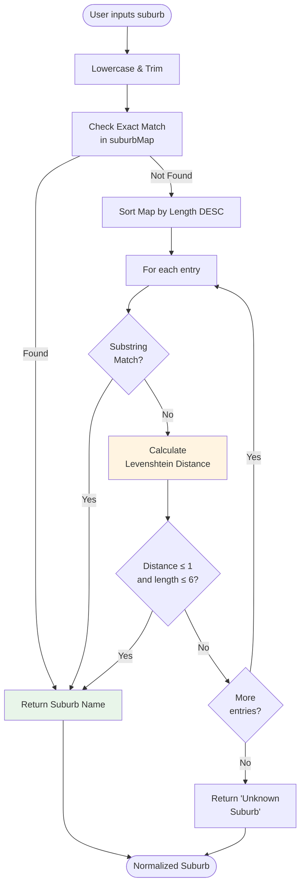
```mermaid
flowchart TD
    Start([User inputs suburb]) --> A[Lowercase & Trim]
    A --> B[Check Exact Match<br/>in suburbMap]
    B -->|Found| C[Return Suburb Name]
    B -->|Not Found| D[Sort Map by Length DESC]
    D --> E[For each entry]
    E --> F{Substring<br/>Match?}
    F -->|Yes| C
    F -->|No| G[Calculate<br/>Levenshtein Distance]
    G --> H{Distance ≤ 1<br/>and length ≤ 6?}
    H -->|Yes| C
    H -->|No| I{More<br/>entries?}
    I -->|Yes| E
    I -->|No| J[Return 'Unknown<br/>Suburb']
    C --> End([Normalized Suburb])
    J --> End
    
    style G fill:#fff4e1
    style C fill:#e8f5e9
```

**Figure 8**: Activity diagram of typo-tolerant suburb recognition.

---

### 9.3 AD-03: Matching Agent Property Scoring Process (Member B)

**Author**: Member B  
**Related Agent**: 🎯 Matching Agent

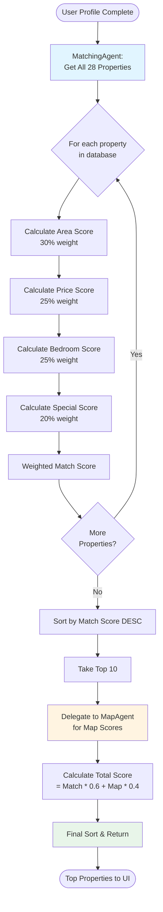
```mermaid
flowchart TD
    Start([User Profile Complete]) --> A[MatchingAgent:<br/>Get All 28 Properties]
    A --> B{For each property<br/>in database}
    B --> C[Calculate Area Score<br/>30% weight]
    C --> D[Calculate Price Score<br/>25% weight]
    D --> E[Calculate Bedroom Score<br/>25% weight]
    E --> F[Calculate Special Score<br/>20% weight]
    F --> G[Weighted Match Score]
    G --> H{More<br/>Properties?}
    H -->|Yes| B
    H -->|No| I[Sort by Match Score DESC]
    I --> J[Take Top 10]
    J --> K[Delegate to MapAgent<br/>for Map Scores]
    K --> L[Calculate Total Score<br/>= Match * 0.6 + Map * 0.4]
    L --> M[Final Sort & Return]
    M --> End([Top Properties to UI])
    
    style A fill:#e1f5ff
    style K fill:#fff4e1
    style M fill:#e8f5e9
```

**Figure 9**: Activity diagram of Matching Agent scoring algorithm.

---

### 9.4 AD-04: Document Agent Passport Verification Process (Member C)

**Author**: Member C  
**Related Agent**: 📄 Document Agent

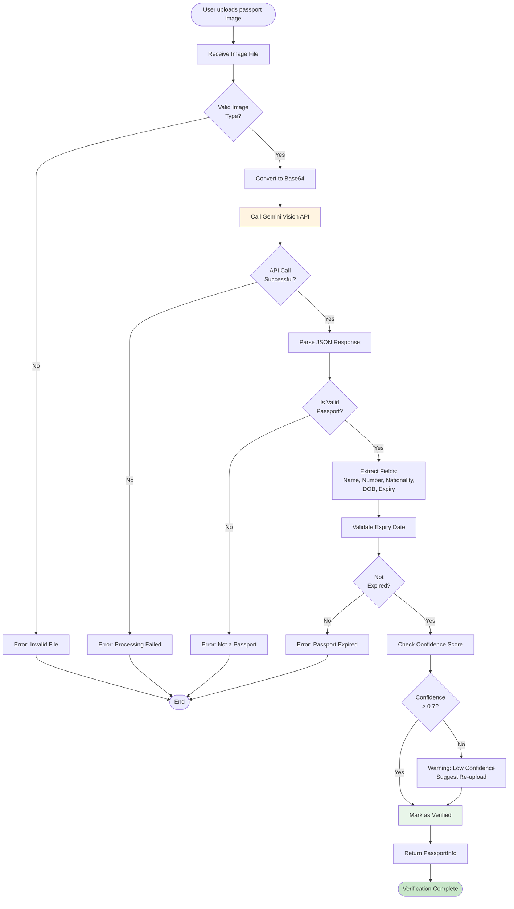
```mermaid
flowchart TD
    Start([User uploads passport image]) --> A[Receive Image File]
    A --> B{Valid Image<br/>Type?}
    B -->|No| B1[Error: Invalid File]
    B1 --> End([End])
    B -->|Yes| C[Convert to Base64]
    C --> D[Call Gemini Vision API]
    D --> E{API Call<br/>Successful?}
    E -->|No| E1[Error: Processing Failed]
    E1 --> End
    E -->|Yes| F[Parse JSON Response]
    F --> G{Is Valid<br/>Passport?}
    G -->|No| G1[Error: Not a Passport]
    G1 --> End
    G -->|Yes| H[Extract Fields:<br/>Name, Number, Nationality,<br/>DOB, Expiry]
    H --> I[Validate Expiry Date]
    I --> J{Not<br/>Expired?}
    J -->|No| J1[Error: Passport Expired]
    J1 --> End
    J -->|Yes| K[Check Confidence Score]
    K --> L{Confidence<br/>> 0.7?}
    L -->|No| L1[Warning: Low Confidence<br/>Suggest Re-upload]
    L -->|Yes| M[Mark as Verified]
    L1 --> M
    M --> N[Return PassportInfo]
    N --> End2([Verification Complete])
    
    style D fill:#fff4e1
    style M fill:#e8f5e9
    style End2 fill:#c8e6c9
```

**Figure 10**: Activity diagram of Document Agent passport verification.

---

### 9.5 AD-05: Map Agent POI Scoring Process (Member D)

**Author**: Member D  
**Related Agent**: 🗺️ Map Agent

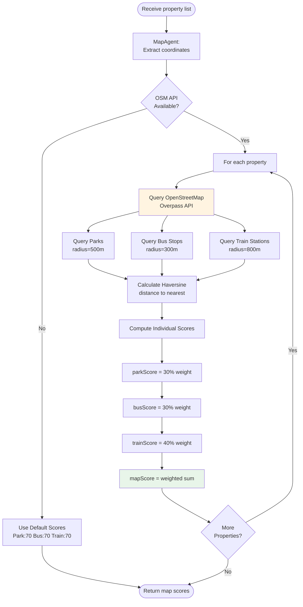
```mermaid
flowchart TD
    Start([Receive property list]) --> A[MapAgent:<br/>Extract coordinates]
    A --> B{OSM API<br/>Available?}
    B -->|No| B1[Use Default Scores<br/>Park:70 Bus:70 Train:70]
    B1 --> End([Return map scores])
    B -->|Yes| C[For each property]
    C --> D[Query OpenStreetMap<br/>Overpass API]
    D --> E[Query Parks<br/>radius=500m]
    D --> F[Query Bus Stops<br/>radius=300m]
    D --> G[Query Train Stations<br/>radius=800m]
    E --> H[Calculate Haversine<br/>distance to nearest]
    F --> H
    G --> H
    H --> I[Compute Individual Scores]
    I --> J[parkScore = 30% weight]
    J --> K[busScore = 30% weight]
    K --> L[trainScore = 40% weight]
    L --> M[mapScore = weighted sum]
    M --> N{More<br/>Properties?}
    N -->|Yes| C
    N -->|No| End
    
    style D fill:#fff4e1
    style M fill:#e8f5e9
```

**Figure 11**: Activity diagram of Map Agent POI scoring algorithm.

---

### 9.6 AD-06: Communication Agent Application Generation Process (Member E)

**Author**: Member E  
**Related Agent**: 📬 Communication Agent

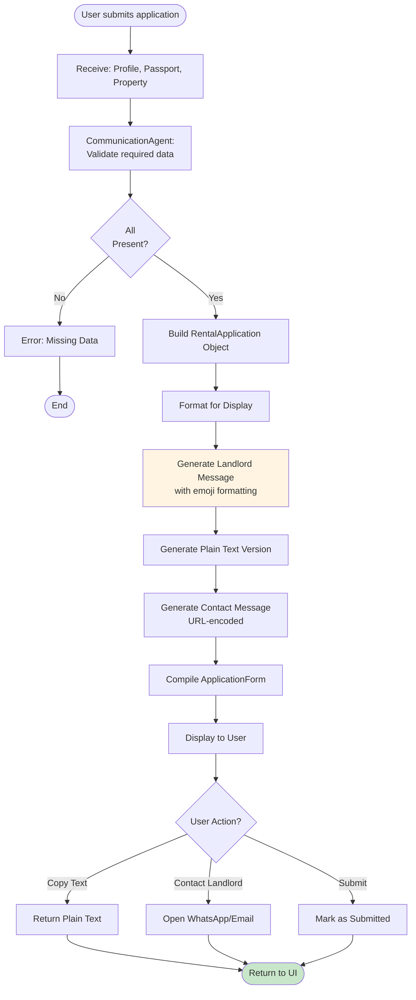
```mermaid
flowchart TD
    Start([User submits application]) --> A[Receive: Profile, Passport, Property]
    A --> B[CommunicationAgent:<br/>Validate required data]
    B --> C{All<br/>Present?}
    C -->|No| C1[Error: Missing Data]
    C1 --> End([End])
    C -->|Yes| D[Build RentalApplication Object]
    D --> E[Format for Display]
    E --> F[Generate Landlord Message<br/>with emoji formatting]
    F --> G[Generate Plain Text Version]
    G --> H[Generate Contact Message<br/>URL-encoded]
    H --> I[Compile ApplicationForm]
    I --> J[Display to User]
    J --> K{User Action?}
    K -->|Copy Text| L[Return Plain Text]
    K -->|Contact Landlord| M[Open WhatsApp/Email]
    K -->|Submit| N[Mark as Submitted]
    L --> End2([Return to UI])
    M --> End2
    N --> End2
    
    style F fill:#fff4e1
    style End2 fill:#c8e6c9
```

**Figure 12**: Activity diagram of Communication Agent application generation.

---

## 10. Interaction Diagrams (Individual Task)

> ⚠️ **Individual Task**: Each student must individually contribute at least one interaction diagram.

### 10.1 ID-01: Document Agent - Passport Verification Sequence (Member C)

**Author**: Member C  
**Related Agent**: 📄 Document Agent

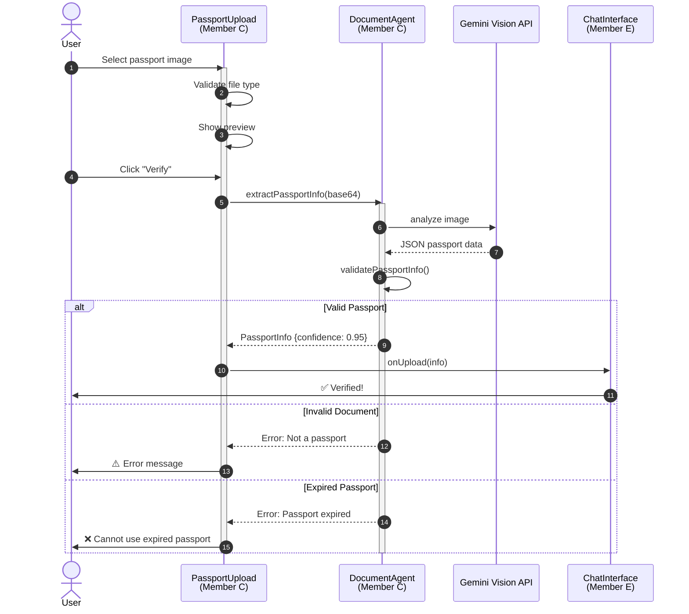
```mermaid
sequenceDiagram
    autonumber
    actor U as User
    participant PU as PassportUpload<br/>(Member C)
    participant DA as DocumentAgent<br/>(Member C)
    participant Gemini as Gemini Vision API
    participant CI as ChatInterface<br/>(Member E)
    
    U->>PU: Select passport image
    activate PU
    PU->>PU: Validate file type
    PU->>PU: Show preview
    U->>PU: Click "Verify"
    PU->>DA: extractPassportInfo(base64)
    activate DA
    DA->>Gemini: analyze image
    Gemini-->>DA: JSON passport data
    DA->>DA: validatePassportInfo()
    alt Valid Passport
        DA-->>PU: PassportInfo {confidence: 0.95}
        PU->>CI: onUpload(info)
        CI->>U: ✅ Verified!
    else Invalid Document
        DA-->>PU: Error: Not a passport
        PU->>U: ⚠️ Error message
    else Expired Passport
        DA-->>PU: Error: Passport expired
        PU->>U: ❌ Cannot use expired passport
    end
    deactivate DA
    deactivate PU
```

**Figure 13**: Sequence diagram of passport verification process.

---

### 10.2 ID-02: Map Agent - POI Query Sequence (Member D)

**Author**: Member D  
**Related Agent**: 🗺️ Map Agent

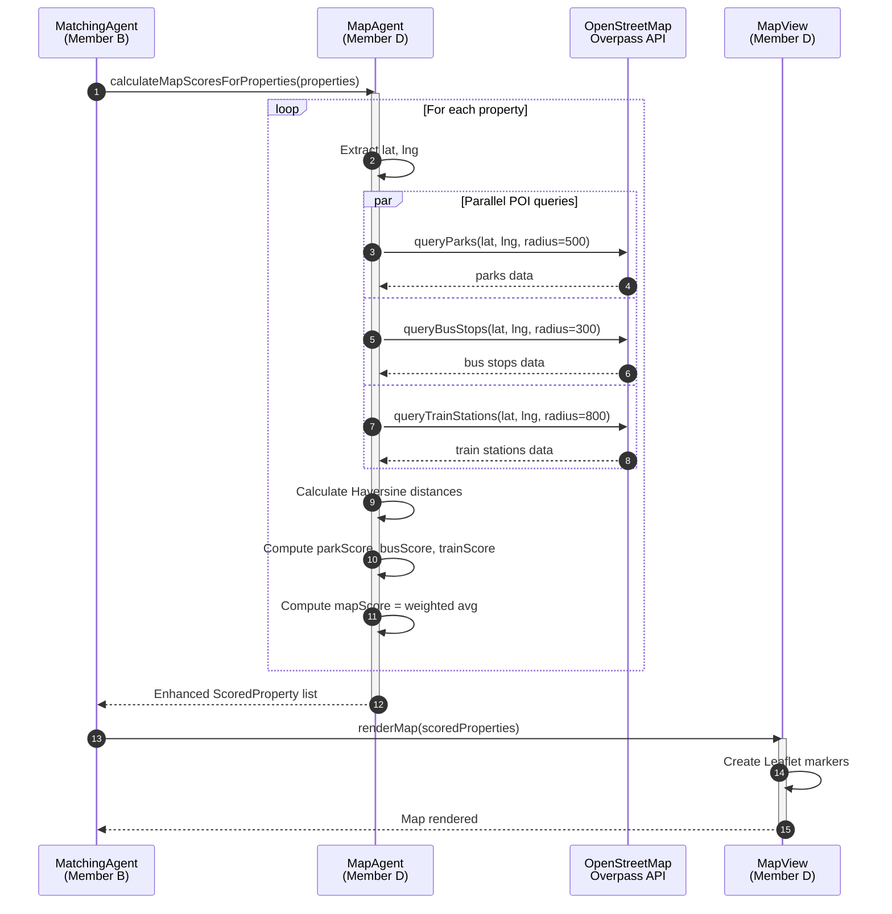
```mermaid
sequenceDiagram
    autonumber
    participant MA as MatchingAgent<br/>(Member B)
    participant MpA as MapAgent<br/>(Member D)
    participant OSM as OpenStreetMap<br/>Overpass API
    participant MV as MapView<br/>(Member D)
    
    MA->>MpA: calculateMapScoresForProperties(properties)
    activate MpA
    loop For each property
        MpA->>MpA: Extract lat, lng
        par Parallel POI queries
            MpA->>OSM: queryParks(lat, lng, radius=500)
            OSM-->>MpA: parks data
        and
            MpA->>OSM: queryBusStops(lat, lng, radius=300)
            OSM-->>MpA: bus stops data
        and
            MpA->>OSM: queryTrainStations(lat, lng, radius=800)
            OSM-->>MpA: train stations data
        end
        MpA->>MpA: Calculate Haversine distances
        MpA->>MpA: Compute parkScore, busScore, trainScore
        MpA->>MpA: Compute mapScore = weighted avg
    end
    MpA-->>MA: Enhanced ScoredProperty list
    deactivate MpA
    
    MA->>MV: renderMap(scoredProperties)
    activate MV
    MV->>MV: Create Leaflet markers
    MV-->>MA: Map rendered
    deactivate MV
```

**Figure 14**: Sequence diagram of Map Agent POI queries.

---

### 10.3 ID-03: Matching Agent - Property Scoring Sequence (Member B)

**Author**: Member B  
**Related Agent**: 🎯 Matching Agent

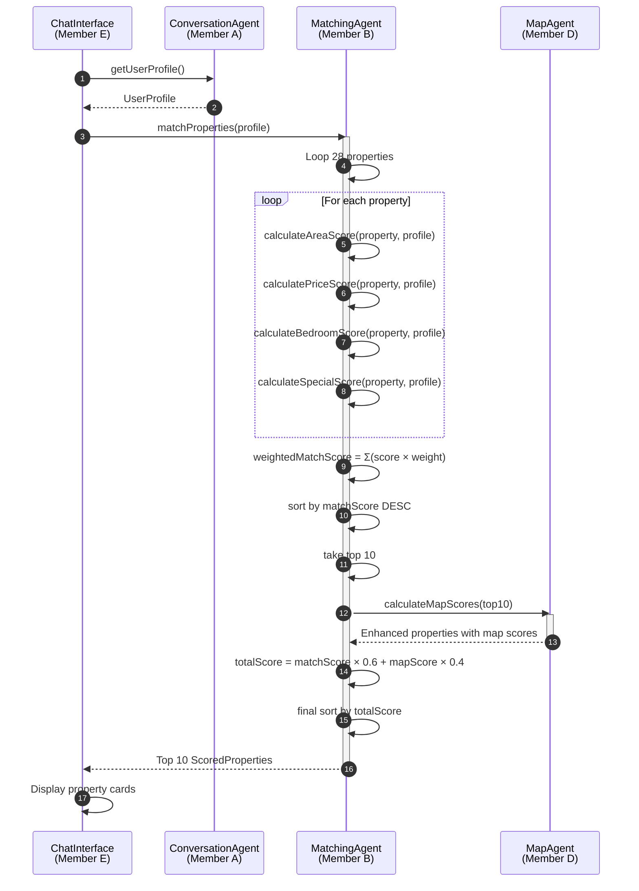
```mermaid
sequenceDiagram
    autonumber
    participant CI as ChatInterface<br/>(Member E)
    participant CA as ConversationAgent<br/>(Member A)
    participant MA as MatchingAgent<br/>(Member B)
    participant MpA as MapAgent<br/>(Member D)
    
    CI->>CA: getUserProfile()
    CA-->>CI: UserProfile
    
    CI->>MA: matchProperties(profile)
    activate MA
    MA->>MA: Loop 28 properties
    
    loop For each property
        MA->>MA: calculateAreaScore(property, profile)
        MA->>MA: calculatePriceScore(property, profile)
        MA->>MA: calculateBedroomScore(property, profile)
        MA->>MA: calculateSpecialScore(property, profile)
    end
    
    MA->>MA: weightedMatchScore = Σ(score × weight)
    MA->>MA: sort by matchScore DESC
    MA->>MA: take top 10
    
    MA->>MpA: calculateMapScores(top10)
    activate MpA
    MpA-->>MA: Enhanced properties with map scores
    deactivate MpA
    
    MA->>MA: totalScore = matchScore × 0.6 + mapScore × 0.4
    MA->>MA: final sort by totalScore
    MA-->>CI: Top 10 ScoredProperties
    deactivate MA
    
    CI->>CI: Display property cards
```

**Figure 15**: Sequence diagram of Matching Agent scoring workflow.

---

### 10.4 ID-04: Communication Agent - Application Generation (Member E)

**Author**: Member E  
**Related Agent**: 📬 Communication Agent

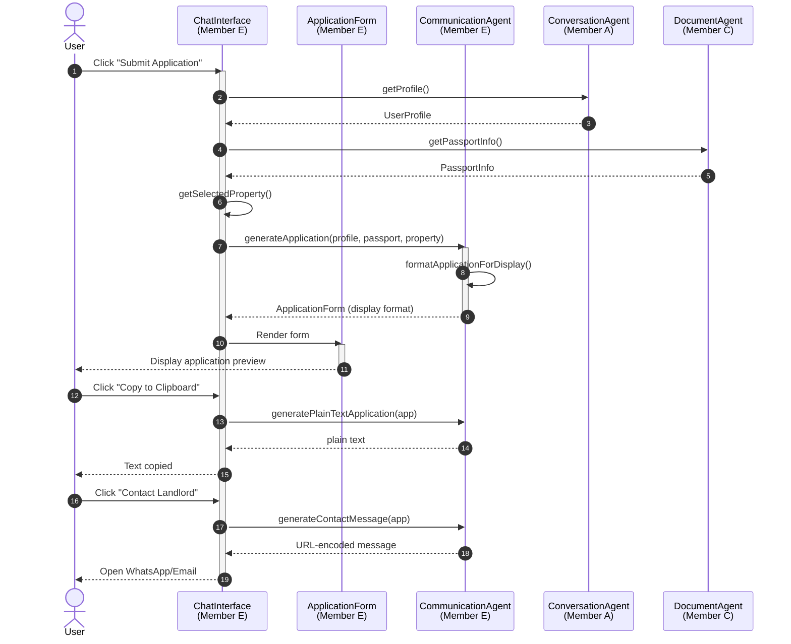
```mermaid
sequenceDiagram
    autonumber
    actor U as User
    participant CI as ChatInterface<br/>(Member E)
    participant AF as ApplicationForm<br/>(Member E)
    participant CoA as CommunicationAgent<br/>(Member E)
    participant CA as ConversationAgent<br/>(Member A)
    participant DA as DocumentAgent<br/>(Member C)
    
    U->>CI: Click "Submit Application"
    activate CI
    CI->>CA: getProfile()
    CA-->>CI: UserProfile
    CI->>DA: getPassportInfo()
    DA-->>CI: PassportInfo
    CI->>CI: getSelectedProperty()
    CI->>CoA: generateApplication(profile, passport, property)
    activate CoA
    CoA->>CoA: formatApplicationForDisplay()
    CoA-->>CI: ApplicationForm (display format)
    deactivate CoA
    CI->>AF: Render form
    activate AF
    AF-->>U: Display application preview
    deactivate AF
    
    U->>CI: Click "Copy to Clipboard"
    CI->>CoA: generatePlainTextApplication(app)
    CoA-->>CI: plain text
    CI-->>U: Text copied
    
    U->>CI: Click "Contact Landlord"
    CI->>CoA: generateContactMessage(app)
    CoA-->>CI: URL-encoded message
    CI-->>U: Open WhatsApp/Email
    deactivate CI
```

**Figure 16**: Sequence diagram of Communication Agent application workflow.

---

### 10.5 ID-05: Conversation Agent - LLM vs Rules Fallback (Member A)

**Author**: Member A  
**Related Agent**: 🤖 Conversation Agent

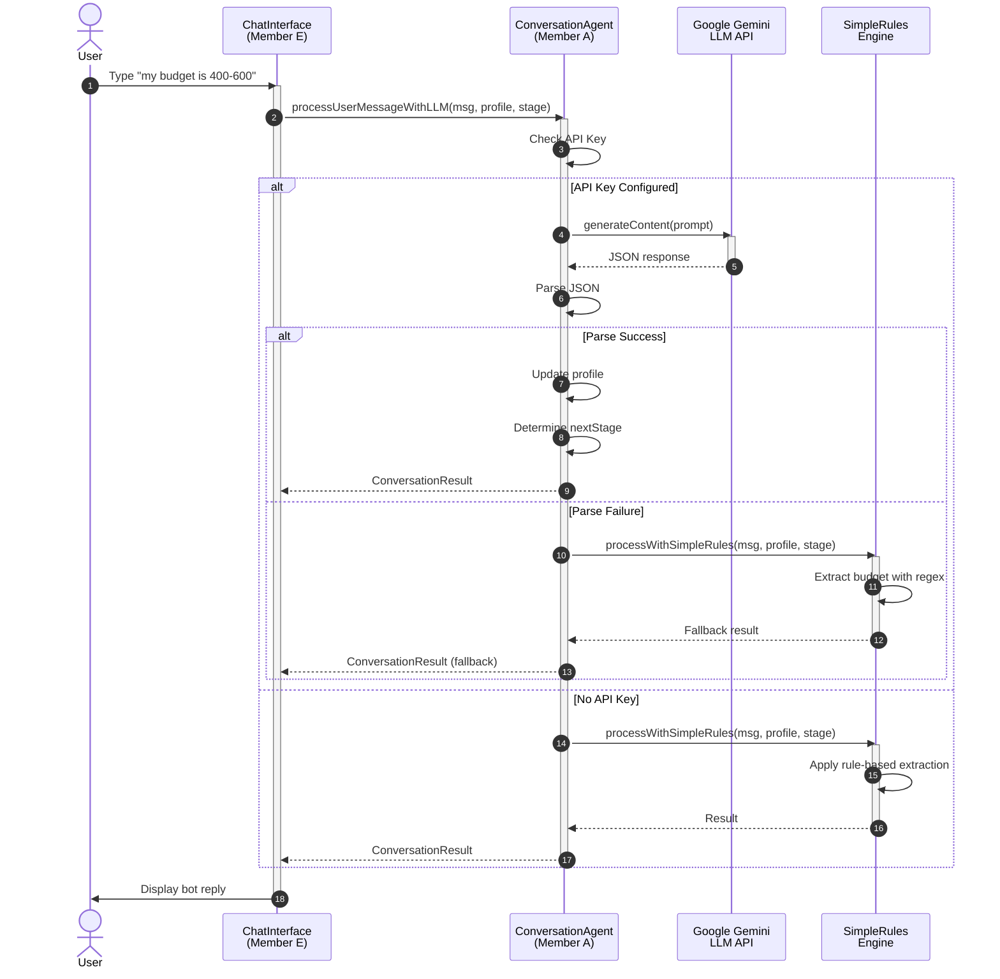
```mermaid
sequenceDiagram
    autonumber
    actor U as User
    participant UI as ChatInterface<br/>(Member E)
    participant CA as ConversationAgent<br/>(Member A)
    participant GM as Google Gemini<br/>LLM API
    participant SR as SimpleRules<br/>Engine
    
    U->>UI: Type "my budget is 400-600"
    activate UI
    UI->>CA: processUserMessageWithLLM(msg, profile, stage)
    activate CA
    
    CA->>CA: Check API Key
    alt API Key Configured
        CA->>GM: generateContent(prompt)
        activate GM
        GM-->>CA: JSON response
        deactivate GM
        CA->>CA: Parse JSON
        alt Parse Success
            CA->>CA: Update profile
            CA->>CA: Determine nextStage
            CA-->>UI: ConversationResult
        else Parse Failure
            CA->>SR: processWithSimpleRules(msg, profile, stage)
            activate SR
            SR->>SR: Extract budget with regex
            SR-->>CA: Fallback result
            deactivate SR
            CA-->>UI: ConversationResult (fallback)
        end
    else No API Key
        CA->>SR: processWithSimpleRules(msg, profile, stage)
        activate SR
        SR->>SR: Apply rule-based extraction
        SR-->>CA: Result
        deactivate SR
        CA-->>UI: ConversationResult
    end
    
    deactivate CA
    UI->>U: Display bot reply
    deactivate UI
```

**Figure 17**: Sequence diagram of Conversation Agent LLM/Rules hybrid processing.

---

## 11. State Machine Diagrams (Individual Task)

> ⚠️ **Individual Task**: Each student must individually contribute at least one state machine diagram modeling their agent's behaviors.

### 11.1 STM-01: Conversation Agent State Machine (Member A)

**Author**: Member A  
**Related Agent**: 🤖 Conversation Agent

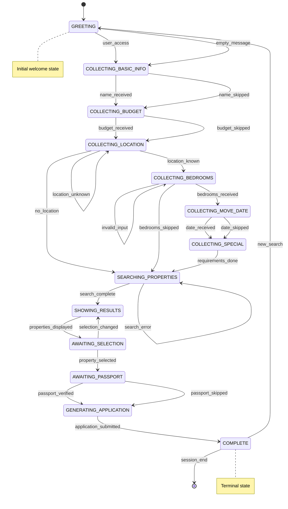
```mermaid
stateDiagram-v2
    [*] --> GREETING
    
    GREETING --> COLLECTING_BASIC_INFO : user_access
    GREETING --> COLLECTING_BASIC_INFO : empty_message
    
    COLLECTING_BASIC_INFO --> COLLECTING_BUDGET : name_received
    COLLECTING_BASIC_INFO --> COLLECTING_BUDGET : name_skipped
    
    COLLECTING_BUDGET --> COLLECTING_LOCATION : budget_received
    COLLECTING_BUDGET --> COLLECTING_LOCATION : budget_skipped
    
    COLLECTING_LOCATION --> COLLECTING_BEDROOMS : location_known
    COLLECTING_LOCATION --> COLLECTING_LOCATION : location_unknown
    COLLECTING_LOCATION --> SEARCHING_PROPERTIES : no_location
    
    COLLECTING_BEDROOMS --> COLLECTING_MOVE_DATE : bedrooms_received
    COLLECTING_BEDROOMS --> COLLECTING_BEDROOMS : invalid_input
    COLLECTING_BEDROOMS --> SEARCHING_PROPERTIES : bedrooms_skipped
    
    COLLECTING_MOVE_DATE --> COLLECTING_SPECIAL : date_received
    COLLECTING_MOVE_DATE --> COLLECTING_SPECIAL : date_skipped
    
    COLLECTING_SPECIAL --> SEARCHING_PROPERTIES : requirements_done
    
    SEARCHING_PROPERTIES --> SHOWING_RESULTS : search_complete
    SEARCHING_PROPERTIES --> SEARCHING_PROPERTIES : search_error
    
    SHOWING_RESULTS --> AWAITING_SELECTION : properties_displayed
    
    AWAITING_SELECTION --> AWAITING_PASSPORT : property_selected
    AWAITING_SELECTION --> SHOWING_RESULTS : selection_changed
    
    AWAITING_PASSPORT --> GENERATING_APPLICATION : passport_verified
    AWAITING_PASSPORT --> GENERATING_APPLICATION : passport_skipped
    
    GENERATING_APPLICATION --> COMPLETE : application_submitted
    
    COMPLETE --> GREETING : new_search
    COMPLETE --> [*] : session_end
    
    note right of GREETING : Initial welcome state
    note right of COMPLETE : Terminal state
```

**Figure 18**: State machine for Conversation Agent dialogue flow.

---

### 11.2 STM-02: Document Agent Verification State Machine (Member C)

**Author**: Member C  
**Related Agent**: 📄 Document Agent

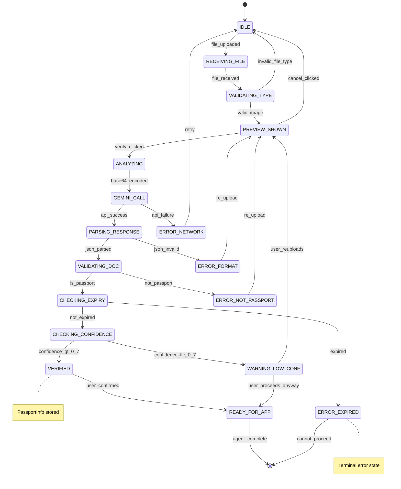
```mermaid
stateDiagram-v2
    [*] --> IDLE
    
    IDLE --> RECEIVING_FILE : file_uploaded
    RECEIVING_FILE --> VALIDATING_TYPE : file_received
    VALIDATING_TYPE --> IDLE : invalid_file_type
    VALIDATING_TYPE --> PREVIEW_SHOWN : valid_image
    
    PREVIEW_SHOWN --> ANALYZING : verify_clicked
    PREVIEW_SHOWN --> IDLE : cancel_clicked
    
    ANALYZING --> GEMINI_CALL : base64_encoded
    GEMINI_CALL --> PARSING_RESPONSE : api_success
    GEMINI_CALL --> ERROR_NETWORK : api_failure
    
    PARSING_RESPONSE --> VALIDATING_DOC : json_parsed
    PARSING_RESPONSE --> ERROR_FORMAT : json_invalid
    
    VALIDATING_DOC --> CHECKING_EXPIRY : is_passport
    VALIDATING_DOC --> ERROR_NOT_PASSPORT : not_passport
    
    CHECKING_EXPIRY --> CHECKING_CONFIDENCE : not_expired
    CHECKING_EXPIRY --> ERROR_EXPIRED : expired
    
    CHECKING_CONFIDENCE --> VERIFIED : confidence_gt_0_7
    CHECKING_CONFIDENCE --> WARNING_LOW_CONF : confidence_lte_0_7
    
    VERIFIED --> READY_FOR_APP : user_confirmed
    WARNING_LOW_CONF --> READY_FOR_APP : user_proceeds_anyway
    WARNING_LOW_CONF --> PREVIEW_SHOWN : user_reuploads
    
    READY_FOR_APP --> [*] : agent_complete
    
    ERROR_NETWORK --> IDLE : retry
    ERROR_FORMAT --> PREVIEW_SHOWN : re_upload
    ERROR_NOT_PASSPORT --> PREVIEW_SHOWN : re_upload
    ERROR_EXPIRED --> [*] : cannot_proceed
    
    note right of VERIFIED : PassportInfo stored
    note right of ERROR_EXPIRED : Terminal error state
```

**Figure 19**: State machine for Document Agent passport verification.

---

### 11.3 STM-03: Communication Agent Application State Machine (Member E)

**Author**: Member E  
**Related Agent**: 📬 Communication Agent

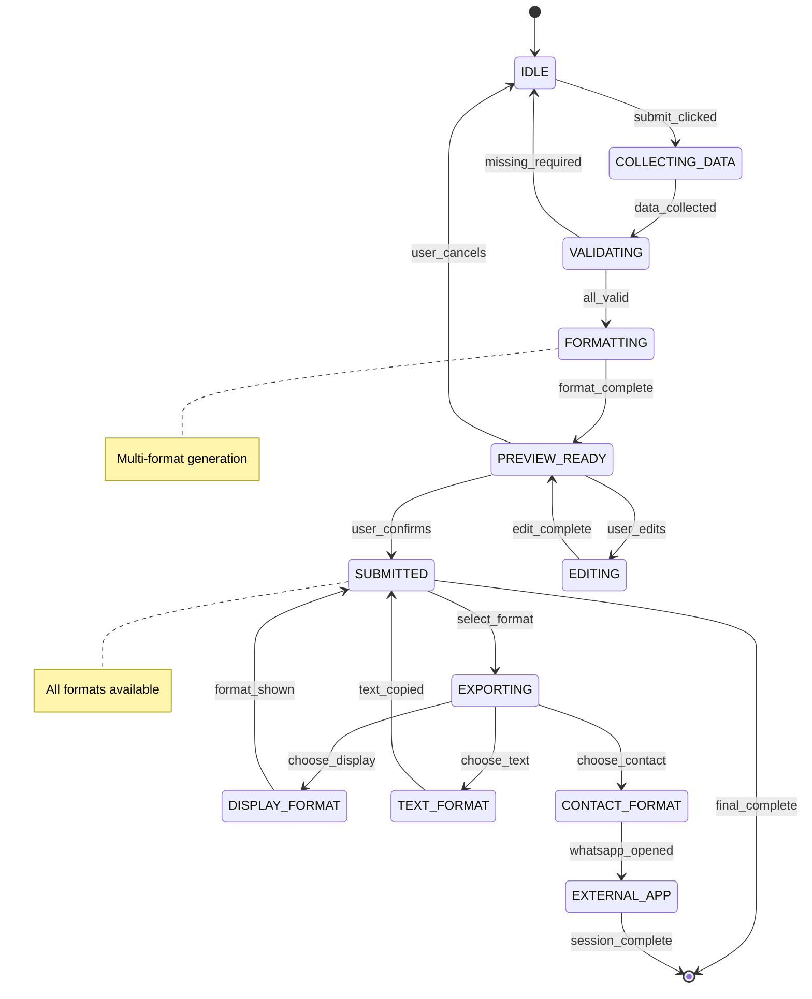
```mermaid
stateDiagram-v2
    [*] --> IDLE
    
    IDLE --> COLLECTING_DATA : submit_clicked
    COLLECTING_DATA --> VALIDATING : data_collected
    
    VALIDATING --> FORMATTING : all_valid
    VALIDATING --> IDLE : missing_required
    
    FORMATTING --> PREVIEW_READY : format_complete
    
    PREVIEW_READY --> SUBMITTED : user_confirms
    PREVIEW_READY --> EDITING : user_edits
    PREVIEW_READY --> IDLE : user_cancels
    
    EDITING --> PREVIEW_READY : edit_complete
    
    SUBMITTED --> EXPORTING : select_format
    SUBMITTED --> [*] : final_complete
    
    EXPORTING --> DISPLAY_FORMAT : choose_display
    EXPORTING --> TEXT_FORMAT : choose_text
    EXPORTING --> CONTACT_FORMAT : choose_contact
    
    DISPLAY_FORMAT --> SUBMITTED : format_shown
    TEXT_FORMAT --> SUBMITTED : text_copied
    CONTACT_FORMAT --> EXTERNAL_APP : whatsapp_opened
    
    EXTERNAL_APP --> [*] : session_complete
    
    note right of FORMATTING : Multi-format generation
    note right of SUBMITTED : All formats available
```

**Figure 20**: State machine for Communication Agent application workflow.

---

### 11.4 STM-04: Matching Agent Property Scoring State Machine (Member B)

**Author**: Member B  
**Related Agent**: 🎯 Matching Agent

```mermaid
stateDiagram-v2
    [*] --> IDLE
    
    IDLE --> RECEIVING_PROFILE : matchRequested
    RECEIVING_PROFILE --> FETCHING_PROPERTIES : profileReceived
    
    FETCHING_PROPERTIES --> SCORING : propertiesLoaded
    FETCHING_PROPERTIES --> ERROR_NO_DATA : dbError
    
    SCORING --> AREA_SCORE : for_each_property
    AREA_SCORE --> PRICE_SCORE : areaCalculated
    PRICE_SCORE --> BEDROOM_SCORE : priceCalculated
    BEDROOM_SCORE --> SPECIAL_SCORE : bedroomCalculated
    SPECIAL_SCORE --> WEIGHTED_TOTAL : specialCalculated
    WEIGHTED_TOTAL --> SCORING : more_properties
    SCORING --> SORTING : allScored
    
    SORTING --> MAP_ENHANCEMENT : sortedByMatchScore
    MAP_ENHANCEMENT --> FINAL_SORT : mapScoresAdded
    FINAL_SORT --> READY : top10Selected
    
    READY --> RETURNING : clientRequest
    
    RETURNING --> [*] : resultsDelivered
    
    ERROR_NO_DATA --> [*] : fatalError
    
    note right of SCORING : 4-dimensional evaluation
    note right of MAP_ENHANCEMENT : Integrates MapAgent data
```

**Figure 21**: State machine for Matching Agent scoring lifecycle.

---

### 11.5 STM-05: Map Agent Data Fetching State Machine (Member D)

**Author**: Member D  
**Related Agent**: 🗺️ Map Agent

```mermaid
stateDiagram-v2
    [*] --> IDLE
    
    IDLE --> REQUEST_RECEIVED : scoringRequested
    REQUEST_RECEIVED --> VALIDATING_INPUT : dataValidated
    
    VALIDATING_INPUT --> CHECKING_CACHE : validInput
    VALIDATING_INPUT --> ERROR_INVALID : invalidCoords
    
    CHECKING_CACHE --> CACHE_HIT : cacheExists
    CHECKING_CACHE --> QUERYING_OSM : cacheEmpty
    
    CACHE_HIT --> SCORING : cachedData
    
    QUERYING_OSM --> QUERY_PARKS : parksAPI
    QUERYING_OSM --> QUERY_BUS_STOPS : busAPI
    QUERYING_OSM --> QUERY_TRAINS : trainAPI
    
    QUERY_PARKS --> PARALLEL_WAIT : awaitingAll
    QUERY_BUS_STOPS --> PARALLEL_WAIT : awaitingAll
    QUERY_TRAINS --> PARALLEL_WAIT : awaitingAll
    
    PARALLEL_WAIT --> COMPUTING_DISTANCES : allPOIReceived
    PARALLEL_WAIT --> PARTIAL_FALLBACK : someFailed
    
    COMPUTING_DISTANCES --> HAVERSINE_CALC : haversineRunning
    HAVERSINE_CALC --> SCORING_CALC : distancesReady
    SCORING_CALC --> READY : scoresComputed
    READY --> CACHING : persisting
    CACHING --> RETURNING : cacheWritten
    RETURNING --> [*] : resultsSent
    
    PARTIAL_FALLBACK --> DEFAULT_SCORES : gracefulFallback
    DEFAULT_SCORES --> RETURNING : defaultApplied
    
    ERROR_INVALID --> [*] : cannotProceed
    
    note right of PARALLEL_WAIT : Promise.all() parallel
    note right of PARTIAL_FALLBACK : Reliability-first design
```

**Figure 22**: State machine for Map Agent POI fetching lifecycle.

---

## 12. Package Diagram (Optional)

> **Lead Member**: Member E (Communication Agent) | **Reviewers**: All members

```mermaid
graph TB
    subgraph "app (Next.js Pages)"
        APP_Page[page.tsx<br/>Member B]
        APP_Layout[layout.tsx<br/>Member B]
        APP_Global[globals.css]
    end
    
    subgraph "components (UI Layer)"
        C_ChatInt["ChatInterface<br/>Member E"]
        C_ChatBubble["ChatBubble<br/>Member A"]
        C_ChatInput["ChatInput<br/>Member A"]
        C_PropertyCard["PropertyCard<br/>Member B"]
        C_MapView["MapView<br/>Member D"]
        C_PassportUpload["PassportUpload<br/>Member C"]
        C_AppForm["ApplicationForm<br/>Member E"]
    end
    
    subgraph "lib (5-Agent Business Logic)"
        L_Types["types.ts<br/>Member A"]
        L_Convo["conversation-agent<br/>Member A"]
        L_Doc["document-agent<br/>Member C"]
        L_Match["matching-agent<br/>Member B"]
        L_Map["map-agent<br/>Member D"]
        L_Comm["communication-agent<br/>Member E"]
        L_Props["properties.ts<br/>Member B"]
    end
    
    subgraph "External Services"
        EXT_Gemini["Google Gemini API"]
        EXT_OSM["OpenStreetMap"]
        EXT_Leaflet["Leaflet Library"]
    end
    
    APP_Page --> C_ChatInt
    APP_Layout --> APP_Global
    APP_Layout --> EXT_Leaflet
    
    C_ChatInt --> C_ChatBubble
    C_ChatInt --> C_ChatInput
    C_ChatInt --> C_PropertyCard
    C_ChatInt --> C_MapView
    C_ChatInt --> C_PassportUpload
    C_ChatInt --> C_AppForm
    C_ChatInt --> L_Convo
    C_ChatInt --> L_Match
    C_ChatInt --> L_Map
    
    C_MapView --> EXT_Leaflet
    C_PassportUpload --> L_Doc
    
    L_Convo --> L_Types
    L_Convo --> EXT_Gemini
    L_Doc --> L_Types
    L_Doc --> EXT_Gemini
    L_Match --> L_Types
    L_Match --> L_Props
    L_Map --> L_Types
    L_Comm --> L_Types
    L_Comm --> L_Doc
```

**Figure 23**: Package diagram showing module organization with agent ownership.

---

## 13. Deployment Diagram (Optional)

> **Lead Member**: Member D (Map Agent) | **Reviewers**: All members

```mermaid
graph TB
    subgraph "Client Device (Browser)"
        Browser["Web Browser<br/>Chrome/Edge/Firefox"]
        ReactApp["React Application"]
        Leaflet["Leaflet Map<br/>(Member D)"]
    end
    
    subgraph "Next.js Server (Vercel/Node)"
        AppServer["Next.js App Router"]
        SSG["Static Pages"]
        APIR["API Routes"]
        subgraph "5-Agent Runtime"
            AgentsCA["🤖 Conversation Agent<br/>(Member A)"]
            AgentsMA["🎯 Matching Agent<br/>(Member B)"]
            AgentsDA["📄 Document Agent<br/>(Member C)"]
            AgentsMpA["🗺️ Map Agent<br/>(Member D)"]
            AgentsCoA["📬 Communication Agent<br/>(Member E)"]
        end
    end
    
    subgraph "External Services"
        Gemini["Google Gemini API<br/>(Members A, C)"]
        OSM["OpenStreetMap<br/>(Member D)"]
        Tiles["OSM Tile Server"]
    end
    
    subgraph "Data Storage"
        PropertyDB[("Property Database<br/>28 Sydney Properties<br/>(Member B)")]
    end
    
    Browser --> ReactApp
    ReactApp --> Leaflet
    ReactApp <-->|HTTPS| AppServer
    Leaflet -->|HTTPS| Tiles
    
    AppServer --> SSG
    AppServer --> APIR
    AppServer --> AgentsCA
    AppServer --> AgentsMA
    AppServer --> AgentsDA
    AppServer --> AgentsMpA
    AppServer --> AgentsCoA
    
    AgentsMA -->|Property Data| PropertyDB
    AgentsCA -->|LLM Calls| Gemini
    AgentsDA -->|Vision API| Gemini
    AgentsMpA -->|POI Queries| OSM
    AgentsCoA -->|Application Data| PropertyDB
    
    style Browser fill:#e3f2fd
    style Gemini fill:#fff3e0
    style OSM fill:#fff3e0
    style PropertyDB fill:#f3e5f5
```

**Figure 24**: Deployment diagram showing 5-agent runtime distribution.

---

## Summary of Individual Contributions by Member

> ✅ **Updated**: Every member now has **at least one Activity Diagram, one Interaction Diagram, and one State Machine Diagram** as required by the individual task criteria (⭐).

| Member | Agent | Ad Hoc Req | Use Case | Activity Diagram | Interaction Diagram | State Machine |
|--------|-------|------------|----------|------------------|---------------------|---------------|
| **Member A** | 🤖 Conversation | AHR-01 | UC-01, UC-02 | AD-01, AD-02 | ID-05 | STM-01 |
| **Member B** | 🎯 Matching | AHR-02 | UC-03 | AD-03 | ID-03 | STM-04 |
| **Member C** | 📄 Document | AHR-03 | UC-05 | AD-04 | ID-01 | STM-02 |
| **Member D** | 🗺️ Map | AHR-04 | UC-04 | AD-05 | ID-02 | STM-05 |
| **Member E** | 📬 Communication | AHR-05 | UC-06 | AD-06 | ID-04 | STM-03 |

### Group Tasks (Shared)

| Task | Lead Member | Other Members |
|------|-------------|---------------|
| Ad Hoc Diagram | Member A | All review |
| Feature Diagram | Member A | All review |
| Use Case Overall Diagram | Member B | All review |
| Architecture Analysis | Member E | All review |
| Class Diagram | Member B | All review |
| Object/Collaboration Diagram | Member D | All review |
| Package Diagram | Member E | All review |
| Deployment Diagram | Member D | All review |

---

## Marking Criteria Self-Assessment (Per Member)

### Member A (Conversation Agent) - Self Assessment
> **Personal score: 5/5 (mandatory individual tasks) + bonus from leading Feature Diagram & Ad Hoc Diagram.**

| Item | Marks | Status | Section |
|------|-------|--------|---------|
| Ad hoc requirements (Individual) | 0.5 | ✅ Complete | §2.1 AHR-01 |
| Feature diagram (Lead) | 1 | ✅ Lead | §3 |
| Ad hoc diagram (Bonus) | +Bonus | ✅ Lead | §1 |
| Use case specifications (Individual) | 2 | ✅ Complete | §5 UC-01, UC-02 |
| Activity diagrams (Individual) | 1.5 | ✅ Complete | §9 AD-01, AD-02 |
| Interaction diagrams (Individual) | 1.5 | ✅ Complete | §10 ID-05 |
| State machine diagrams (Individual) | 1.5 | ✅ Complete | §11 STM-01 |
| **Mandatory Personal Subtotal** | **5.0** | ✅ | |
| **+ Bonus / Leading** | **+2** | | |

### Member B (Matching Agent) - Self Assessment
> **Personal score: 5/5 (mandatory individual tasks) + bonus from leading Use Case Overall & Class Diagram.**

| Item | Marks | Status | Section |
|------|-------|--------|---------|
| Ad hoc requirements (Individual) | 0.5 | ✅ Complete | §2.2 AHR-02 |
| Use case overall diagram (Lead) | 1 | ✅ Lead | §4 |
| Class Diagram (Lead) | 3 | ✅ Lead | §7 |
| Use case specifications (Individual) | 2 | ✅ Complete | §5 UC-03 |
| Activity diagrams (Individual) | 1.5 | ✅ Complete | §9 AD-03 |
| Interaction diagrams (Individual) | 1.5 | ✅ Complete | §10 ID-03 |
| State machine diagrams (Individual) | 1.5 | ✅ Complete | §11 STM-04 |
| **Mandatory Personal Subtotal** | **5.0** | ✅ | |
| **+ Bonus / Leading** | **+4** | | |

### Member C (Document Agent) - Self Assessment
> **Personal score: 5/5 (mandatory individual tasks) + review on shared tasks.**

| Item | Marks | Status | Section |
|------|-------|--------|---------|
| Ad hoc requirements (Individual) | 0.5 | ✅ Complete | §2.3 AHR-03 |
| Use case specifications (Individual) | 2 | ✅ Complete | §5 UC-05 |
| Activity diagrams (Individual) | 1.5 | ✅ Complete | §9 AD-04 |
| Interaction diagrams (Individual) | 1.5 | ✅ Complete | §10 ID-01 |
| State machine diagrams (Individual) | 1.5 | ✅ Complete | §11 STM-02 |
| **Mandatory Personal Subtotal** | **5.0** | ✅ | |

### Member D (Map Agent) - Self Assessment
> **Personal score: 5/5 (mandatory individual tasks) + bonus from leading Object/Collab & Deployment Diagram.**

| Item | Marks | Status | Section |
|------|-------|--------|---------|
| Ad hoc requirements (Individual) | 0.5 | ✅ Complete | §2.4 AHR-04 |
| Use case specifications (Individual) | 2 | ✅ Complete | §5 UC-04 |
| Object/Collab Diagram (Lead) | 3 | ✅ Lead | §8 |
| Deployment diagram (Bonus) | +Bonus | ✅ Lead | §13 |
| Activity diagrams (Individual) | 1.5 | ✅ Complete | §9 AD-05 |
| Interaction diagrams (Individual) | 1.5 | ✅ Complete | §10 ID-02 |
| State machine diagrams (Individual) | 1.5 | ✅ Complete | §11 STM-05 |
| **Mandatory Personal Subtotal** | **5.0** | ✅ | |
| **+ Bonus / Leading** | **+3** | | |

### Member E (Communication Agent + Integration) - Self Assessment
> **Personal score: 5/5 (mandatory individual tasks) + bonus from leading Architecture & Package Diagram.**

| Item | Marks | Status | Section |
|------|-------|--------|---------|
| Ad hoc requirements (Individual) | 0.5 | ✅ Complete | §2.5 AHR-05 |
| Use case specifications (Individual) | 2 | ✅ Complete | §5 UC-06 |
| Architecture Analysis (Bonus) | +Bonus | ✅ Lead | §6 |
| Package diagram (Bonus) | +Bonus | ✅ Lead | §12 |
| Activity diagrams (Individual) | 1.5 | ✅ Complete | §9 AD-06 |
| Interaction diagrams (Individual) | 1.5 | ✅ Complete | §10 ID-04 |
| State machine diagrams (Individual) | 1.5 | ✅ Complete | §11 STM-03 |
| **Mandatory Personal Subtotal** | **5.0** | ✅ | |
| **+ Bonus / Leading** | **+2** | | |

---

## Total Score Estimate

### 📊 ELEC5620 Project Stage 1 Total = **30 Marks**

> **Source**: Canvas "Stage One Report Submission" rubric (25 marks) + "Video Presentation" rubric (5 marks).

| Component | Canvas Item | Marks |
|-----------|-------------|-------|
| **1. Report** (PDF) | Stage One Report Submission | 15 |
| **2. Interview** (Live, Week 11–12) | Stage One Report Submission | 10 |
| **3. Video Presentation** (≤8 min) | Stage One Video Presentation Submission | 5 |
| **TOTAL** | | **30** |

### Report Mandatory Items (15 points) — Based on Official Canvas Rubric

> ✅ **All 15 mandatory marks covered.**

| Category | Marks | Status | Section |
|----------|-------|--------|---------|
| Ad hoc requirements (Individual × 5) | 0.5 × 5 = 2.5 | ✅ | §2 |
| Feature diagram | 1 | ✅ | §3 |
| Use case overall diagram | 1 | ✅ | §4 |
| Use case specifications (Individual × 5–10) | 2 | ✅ | §5 (6 use cases) |
| Elementary Structure (Class Diagram) | 3 | ✅ | §7 |
| Complex Structure (Object/Collab) | 3 | ✅ | §8 |
| Activity diagrams (Individual × 5) | 1.5 | ✅ | §9 (6 diagrams) |
| Interaction diagrams (Individual × 5) | 1.5 | ✅ | §10 (5 diagrams) |
| State machine diagrams (Individual × 5) | 1.5 | ✅ | §11 (5 diagrams) |
| **Report Subtotal** | **15/15** | ✅ | |

### Optional / Bonus Items (extra credit beyond 15)

| Category | Status | Section |
|----------|--------|---------|
| Ad hoc diagram | ✅ | §1 |
| Architecture Analysis (4+1 View) | ✅ | §6 |
| Package diagram | ✅ | §12 |
| Deployment diagram | ✅ | §13 |

### Interview (10 points) — To Be Conducted Week 11–12

| Member | Preparation Status | Key Talking Points |
|--------|--------------------|---------------------|
| Member A | ✅ Ready | Conversation Agent: AHR-01, UC-01/02, AD-01/02, ID-05, STM-01 |
| Member B | ✅ Ready | Matching Agent: AHR-02, UC-03, AD-03, ID-03, STM-04, Class Diagram lead |
| Member C | ✅ Ready | Document Agent: AHR-03, UC-05, AD-04, ID-01, STM-02 |
| Member D | ✅ Ready | Map Agent: AHR-04, UC-04, AD-05, ID-02, STM-05, Object/Collab + Deployment lead |
| Member E | ✅ Ready | Communication Agent: AHR-05, UC-06, AD-06, ID-04, STM-03, Architecture + Package lead |

### Video Presentation (5 points) — Separate Canvas Submission

- **Due**: Sun Oct 4, 2026, 11:59pm
- **Length**: ≤ 8 minutes
- **Submission**: PDF Link / YouTube link on Canvas
- **Status**: To be recorded by group this week

### ✅ Individual Contribution Verification (Critical for Marking)

| Member | Ad Hoc | Activity | Interaction | State Machine | ✅ All 4 Met? |
|--------|---------|----------|-------------|---------------|---------------|
| A | AHR-01 | AD-01, AD-02 | ID-05 | STM-01 | ✅ Yes |
| B | AHR-02 | AD-03 | ID-03 | STM-04 | ✅ Yes |
| C | AHR-03 | AD-04 | ID-01 | STM-02 | ✅ Yes |
| D | AHR-04 | AD-05 | ID-02 | STM-05 | ✅ Yes |
| E | AHR-05 | AD-06 | ID-04 | STM-03 | ✅ Yes |

**Every member has at least one item in each of the 4 individual task categories.** ✅

---

## Notes on Consistency with Code

Each ad hoc requirement, use case, activity diagram, interaction diagram, and state machine in this report is directly derived from and consistent with the actual implementation in the codebase:

- **Conversation Agent**: `lib/conversation-agent.ts`, `lib/types.ts`
- **Matching Agent**: `lib/matching-agent.ts`, `lib/properties.ts`
- **Document Agent**: `lib/document-agent.ts`
- **Map Agent**: `lib/map-agent.ts`
- **Communication Agent**: `lib/communication-agent.ts`
- **Integration**: `components/ChatInterface.tsx`

All design models align with the working implementation of HomeMatch AI as required by the marking criteria.

---

**Report Compiled By**: Group Members  
**Date**: Sep 30, 2026  
**Based on Codebase**: c:\Users\18021\Desktop\Assignment1
