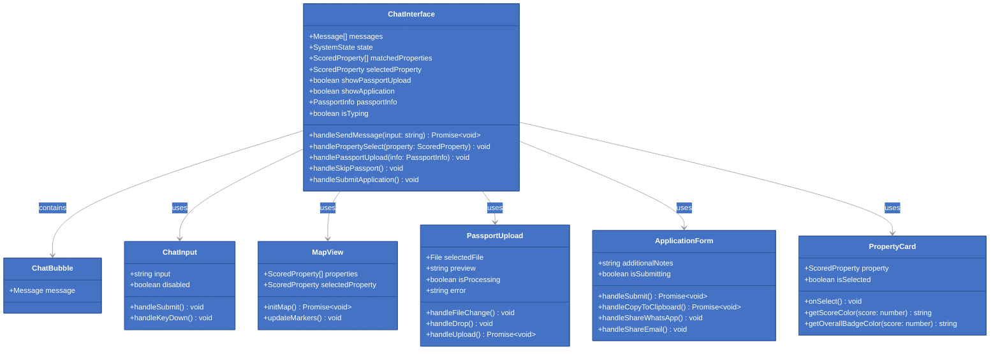
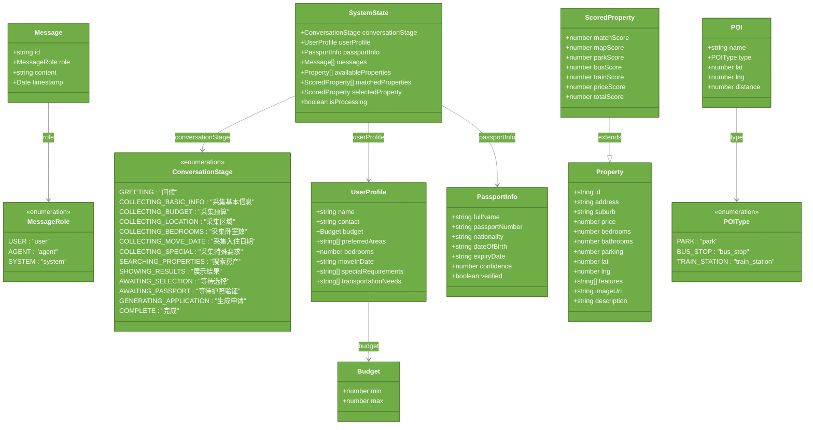
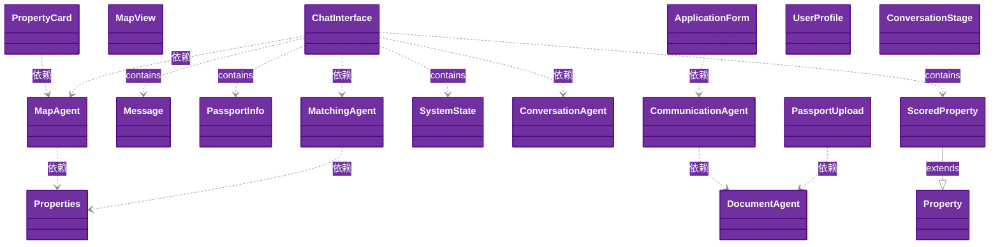
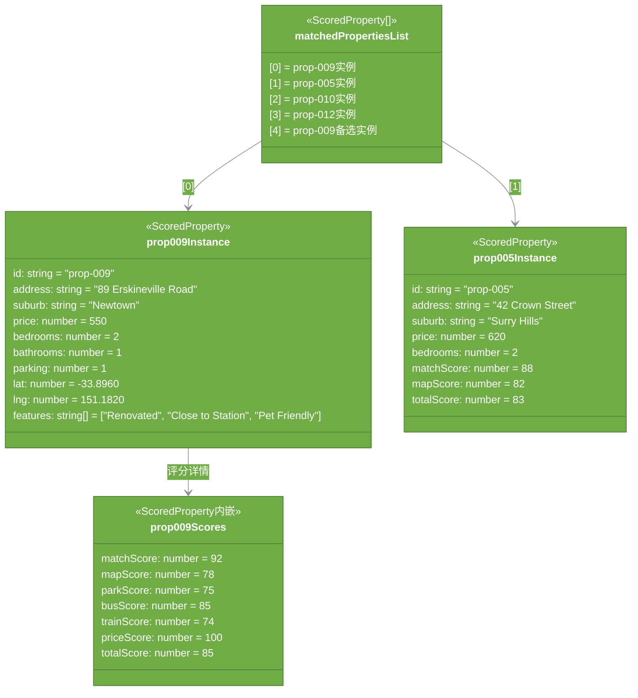
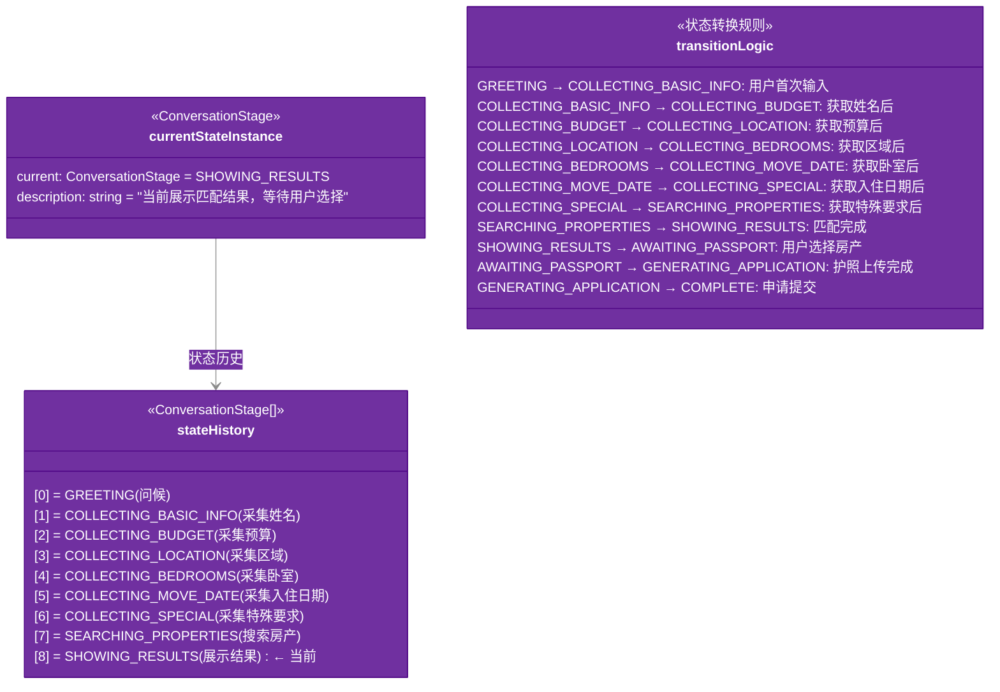
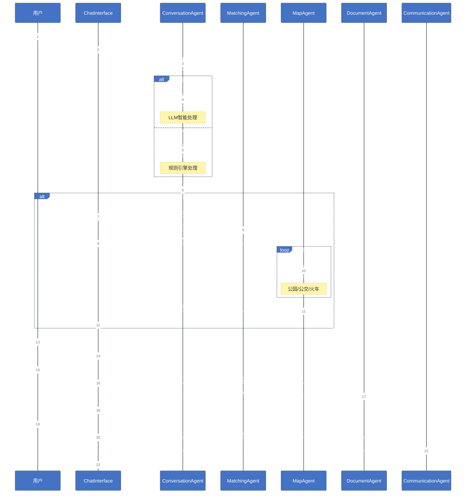

# HomeMatch AI - Mermaid 类图和对象图

## 一、类图 (Class Diagram)

### 1.1 系统整体架构类图



### 1.2 核心类型类图



### 1.3 Agent层类图

```mermaid
%%{init: {'theme':'base', 'themeVariables': { 'primaryColor': '#ED7D31', 'primaryTextColor': '#fff', 'primaryBorderColor': '#C55A11', 'lineColor': '#8C8C8C', 'secondaryColor': '#EDEDED', 'tertiaryColor': '#F5F5F5'}}}%%
classDiagram
    direction TB
    
    class ConversationAgent {
        +processUserMessageWithLLM(message, profile, stage) Promise~ConversationResult~
        +processUserMessage(message, profile, stage) ConversationResult
        +generateProfileSummary(profile) string
        -processWithGemini(message, profile, stage) Promise~ConversationResult~
        -processWithSimpleRules(message, profile, stage) ConversationResult
        -buildConversationHistory(profile) string
    }
    
    class ConversationResult {
        +Partial~UserProfile~ updatedProfile
        +string reply
        +ConversationStage stage
        +boolean shouldSearch
    }
    
    class MatchingAgent {
        +matchProperties(profile) ScoredProperty[]
        +getPropertyById(id) ScoredProperty
        +generateMatchSummary(property, profile) string
        -calculateAreaScore(property, profile) number
        -calculatePriceScore(property, profile) number
        -calculateBedroomScore(property, profile) number
        -calculateSpecialScore(property, profile) number
    }
    
    class MapAgent {
        +calculateMapScores(property) Promise~MapScoreResult~
        +calculateMapScoresForProperties(properties) Promise~ScoredProperty[]~
        +formatPOISummary(parks, busStops, trains) string
        +getScoreBreakdown(property) ScoreItem[]
        -findParks(lat, lng, radius) Promise~POI[]~
        -findBusStops(lat, lng, radius) Promise~POI[]~
        -findTrainStations(lat, lng, radius) Promise~POI[]~
        -calculateParkScore(parks) number
        -calculateBusScore(busStops) number
        -calculateTrainScore(stations) number
        -calculateDistance(lat1, lon1, lat2, lon2) number
    }
    
    class MapScoreResult {
        +number parkScore
        +number busScore
        +number trainScore
        +number mapScore
        +POI[] nearbyParks
        +POI[] nearbyBusStops
        +POI[] nearbyTrainStations
    }
    
    class DocumentAgent {
        +extractPassportInfo(imageBase64) Promise~PassportInfo~
        +extractPassportInfoWithGemini(imageBase64, apiKey) Promise~PassportInfo~
        +validatePassportInfo(info) ValidationResult
        +formatPassportSummary(info) string
    }
    
    class ValidationResult {
        +boolean valid
        +string[] errors
    }
    
    class CommunicationAgent {
        +generateApplication(profile, passport, property, notes) RentalApplication
        +formatApplicationForDisplay(application) ApplicationForm
        +generateLandlordMessage(application) string
        +generateApplicationSummary(application) SummaryItem[]
        +generatePlainTextApplication(application) string
        +generateContactMessage(application) string
    }
    
    class RentalApplication {
        +UserProfile userProfile
        +PassportInfo passportInfo
        +ScoredProperty selectedProperty
        +string additionalNotes
        +Date submittedAt
    }
    
    class Properties {
        +Property[] properties
        +getPropertyById(id) Property
        +getPropertiesBySuburb(suburb) Property[]
        +getAllSuburbs() string[]
    }
    
    ConversationAgent ..> ConversationResult : returns
    ConversationAgent ..> UserProfile : uses
    MatchingAgent ..> ScoredProperty : returns
    MatchingAgent ..> Property : uses
    MapAgent ..> MapScoreResult : returns
    MapAgent ..> POI : uses
    DocumentAgent ..> PassportInfo : returns
    DocumentAgent ..> ValidationResult : returns
    CommunicationAgent ..> RentalApplication : returns
    CommunicationAgent ..> ApplicationForm : returns
    MatchingAgent --> Properties : uses
    MapAgent --> Properties : uses
```



### 1.4 完整依赖关系图



---

## 二、对象图 (Object Diagram)

### 2.1 用户会话对象图

```mermaid
%%{init: {'theme':'base', 'themeVariables': { 'primaryColor': '#4472C4', 'primaryTextColor': '#fff', 'primaryBorderColor': '#2F5496', 'lineColor': '#8C8C8C', 'secondaryColor': '#EDEDED', 'tertiaryColor': '#F5F5F5'}}}%%
classDiagram
    direction TB
    
    class chatInterfaceInstance {
        <<ChatInterface>>
        state: SystemState = {...}
        messages: Message[] = [5条消息]
        matchedProperties: ScoredProperty[] = [5个房产]
        selectedProperty: ScoredProperty = prop-009
        showPassportUpload: boolean = false
        showApplication: boolean = false
    }
    
    class systemStateInstance {
        <<SystemState>>
        conversationStage: ConversationStage = SHOWING_RESULTS
        userProfile: UserProfile = {...}
        isProcessing: boolean = false
    }
    
    class userProfileInstance {
        <<UserProfile>>
        name: string = "张三"
        contact: string = "zhang@example.com"
        budget: Budget = {min: 400, max: 600}
        preferredAreas: string[] = ["Newtown", "Surry Hills"]
        bedrooms: number = 2
        moveInDate: string = "ASAP"
        specialRequirements: string[] = ["Pet Friendly", "Near Transport"]
    }
    
    class budgetInstance {
        <<Budget>>
        min: number = 400
        max: number = 600
    }
    
    chatInterfaceInstance --> systemStateInstance : state
    chatInterfaceInstance --> userProfileInstance : userProfile
    systemStateInstance --> userProfileInstance : userProfile
    userProfileInstance --> budgetInstance : budget
```

### 2.2 房产匹配对象图



### 2.3 护照验证对象图

```mermaid
%%{init: {'theme':'base', 'themeVariables': { 'primaryColor': '#ED7D31', 'primaryTextColor': '#fff', 'primaryBorderColor': '#C55A11', 'lineColor': '#8C8C8C', 'secondaryColor': '#EDEDED', 'tertiaryColor': '#F5F5F5'}}}%%
classDiagram
    direction TB
    
    class passportInfoInstance {
        <<PassportInfo>>
        fullName: string = "John Smith"
        passportNumber: string = "PA1234567"
        nationality: string = "Australian"
        dateOfBirth: string = "1990-05-15"
        expiryDate: string = "2030-05-15"
        confidence: number = 0.95
        verified: boolean = true
    }
    
    class applicationInstance {
        <<RentalApplication>>
        userProfile: UserProfile = {...}
        passportInfo: PassportInfo = passportInfoInstance
        selectedProperty: ScoredProperty = prop-009Instance
        additionalNotes: string = ""
        submittedAt: Date = 2026-09-14T10:30:00.000Z
    }
    
    applicationInstance --> passportInfoInstance : passportInfo
```

### 2.4 对话状态机对象图



---

## 三、流程图 (补充)

### 3.1 系统工作流程图

```mermaid
%%{init: {'theme':'base', 'themeVariables': { 'primaryColor': '#4472C4', 'primaryTextColor': '#fff', 'primaryBorderColor': '#2F5496', 'lineColor': '#8C8C8C'}}}%%
flowchart TD
    subgraph 用户交互层
        A[用户输入] --> B{ChatInterface}
    end
    
    subgraph 对话处理
        B --> C{conversation-agent}
        C --> D{检查API Key}
        D -->|有Key| E[processWithGemini]
        D -->|无Key| F[processWithSimpleRules]
        E --> G[LLM处理]
        F --> H[规则引擎处理]
        G --> I[返回结果]
        H --> I
    end
    
    subgraph 房产匹配
        I -->|shouldSearch=true| J{matching-agent}
        J --> K[遍历28个房产]
        K --> L[计算各项评分]
        L --> M[matchScore]
        L --> N[priceScore]
        L --> O[specialScore]
        M --> P[综合评分排序]
        N --> P
        O --> P
    end
    
    subgraph 地图评分
        P --> Q{map-agent}
        Q --> R[查询Overpass API]
        R --> S[findParks 500m]
        R --> T[findBusStops 300m]
        R --> U[findTrainStations 800m]
        S --> V[parkScore]
        T --> W[busScore]
        U --> X[trainScore]
        V --> Y[mapScore]
        W --> Y
        X --> Y
    end
    
    subgraph 护照验证
        Y --> Z[返回ScoredProperty[]]
        Z --> AA[用户选择房产]
        AA --> BB{选择prop-009}
        BB -->|是| CC{PassportUpload}
        CC --> DD[用户上传护照]
        DD --> EE{document-agent}
        EE --> FF[extractPassportInfo]
        FF --> GG[PassportInfo]
    end
    
    subgraph 申请生成
        GG --> HH{ApplicationForm}
        HH --> II[用户补充信息]
        II --> JJ{communication-agent}
        JJ --> KK[generateApplication]
        KK --> LL[RentalApplication]
        LL --> MM[完成]
    end
    
    style A fill:#e1f5ff,stroke:#01579b
    style MM fill:#c8e6c9,stroke:#2e7d32
    style CC fill:#fff3e0,stroke:#ef6c00
```

### 3.2 Agent协作时序图



---

## 四、Mermaid使用说明

### 4.1 如何查看Mermaid图表

1. **VS Code / Cursor**: 安装 `Markdown Preview Mermaid Support` 插件
2. **GitHub/GitLab**: 直接在Markdown中渲染
3. **在线编辑器**: https://mermaid.live
4. **Typora**: 直接支持Mermaid

### 4.2 在Markdown中使用

````markdown
```mermaid
%% 这里放Mermaid代码 %%
```
````

### 4.3 自定义主题颜色

```mermaid
%%{init: {'theme': 'base', 'themeVariables': { 
    'primaryColor': '#4472C4',
    'primaryTextColor': '#fff',
    'primaryBorderColor': '#2F5496',
    'lineColor': '#8C8C8C',
    'secondaryColor': '#EDEDED'
}}}%%
```
